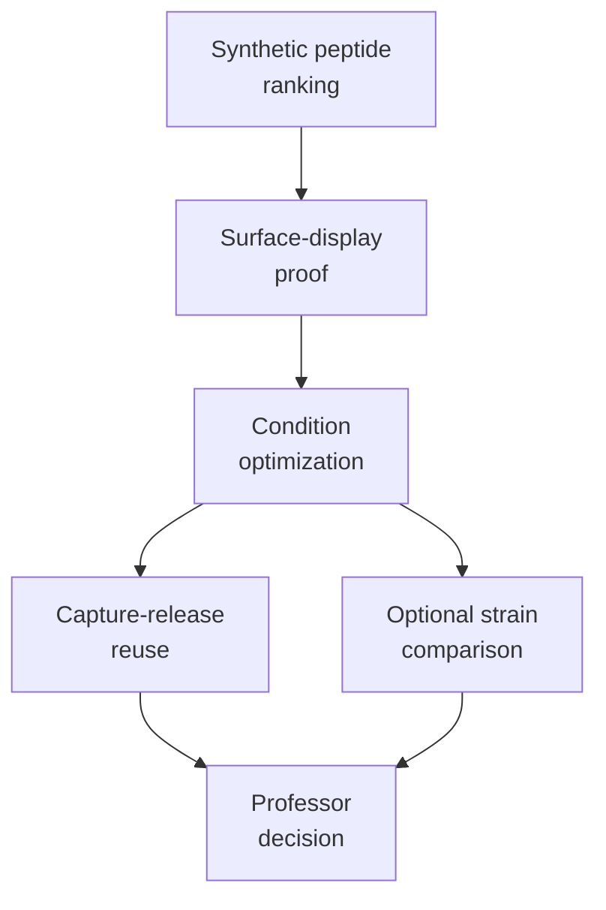

# Professor Discussion Brief

## One-Sentence Project Update

I plan to order synthetic LiSPER peptides first, experimentally rank their Li+/Na+ binding behavior, and then use bacterial surface display only for the best candidates to test whether they can become a low-cost, reusable lithium-capture material.

## Why This Changes Track B

The surface-display track is no longer the first proof that LiSPER peptides bind lithium.

Instead, Track B becomes a translation and engineering study:

> After a peptide works in purified form, can the same peptide retain Li+/Na+ selectivity when displayed on a bacterial surface, and can the displayed cells capture, release, and reuse lithium under useful conditions?

## Proposed Study Design



## Recommended First Version

| Design choice | Proposed first decision | Why |
|---|---|---|
| Candidate number | top 2-3 synthetic peptide hits plus reference controls | limits plasmid cost and assay complexity |
| Host | `E. coli` K-12 / MG1655-compatible strain | lowest-risk academic proof-of-concept |
| Display system | eCPX | best match to small peptide surface display |
| Display quantification | flow cytometry if available; plate fluorescence if not | needed to normalize capture by display level |
| Ion quantification | ICP-OES if accessible | strongest Li/Na measurement for publication |
| Cell format | live and fixed cells side-by-side | separates passive surface binding from cell physiology |
| First optimization | pH, Na competition, contact time, cell loading | directly supports capture-condition selection |
| Reuse test | 3-cycle capture-release screen for top candidate | supports cost-reduction and recycling argument |

## What I Want To Ask

1. Should the first surface-display study include only eCPX, or also one simpler display comparator such as OmpX/Lpp-OmpA?
2. How many synthetic peptide hits should be carried into display: top 2, top 3, or top 4?
3. Is flow cytometry available for display-level quantification?
4. Is ICP-OES or ICP-MS available for Li/Na quantification?
5. Should fixed-cell testing be required in the first round?
6. Should regeneration/reuse be part of the first manuscript-level dataset?
7. Should strain comparison be included now, or saved until after the base assay works?

## Proposed Priority Order

| Priority | Work package | Keep or defer |
|---:|---|---|
| 1 | Surface-display proof in one host | keep |
| 2 | Condition optimization | keep |
| 3 | Capture-release-reuse | keep if first capture signal is strong |
| 4 | Strain comparison | defer unless time/resources are strong |

## Possible Paper Story

The strongest paper story would be:

> Synthetic peptide testing identified promising LiSPER candidates. Surface display then converted the best candidates into bacterial capture materials. By measuring display level, Li/Na uptake, operating condition, and regeneration performance, we identified a candidate and condition suitable for future lithium-recovery development.

## Data Table Target

| Construct | Display level | Li uptake | Na uptake | Selectivity | Best condition | Reuse retained |
|---|---:|---:|---:|---:|---|---:|
| Non-display host | baseline | background | background | baseline | not applicable | not applicable |
| Empty eCPX | measured | background | background | baseline | not applicable | not applicable |
| Reference peptide | measured | low/moderate | measured | low | not advanced | not advanced |
| LiSPER top candidate | measured | high | low | high | optimized | measured |

## Decision Needed From Meeting

The most important decision is the scope of the first Track B study:

```text
Minimal publishable scope:
surface display proof + Li/Na capture + small condition matrix

Stronger translation scope:
surface display proof + condition optimization + regeneration/reuse

Expanded engineering scope:
surface display proof + condition optimization + regeneration/reuse + strain comparison
```

My recommended scope is the stronger translation scope, with strain comparison saved as an optional follow-up.
