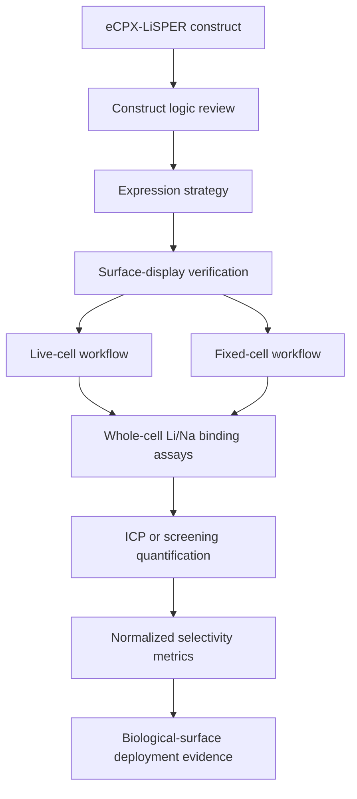

# Track B Protocol: eCPX Surface-Display LiSPER Validation

## Purpose

Track B answers the biological-deployment question:

> Can LiSPER remain functional when displayed on a biological surface?

This track is not a rescue strategy for peptide purification. It provides different evidence from Track A: surface expression, surface accessibility, whole-cell lithium capture, and Li+/Na+ selectivity in a deployable biological format.

Starting point: eCPX surface-display construct.

Ending point: whole-cell Li+/Na+ selectivity data.

## Scientific Logic



## 1. Construct Logic Review

Why:

- Ensures the construct can answer the assay question before cloning or expression.

Expected outcome:

- A construct set that separates peptide effects from scaffold, tag, and cell-surface effects.

Review points:

- eCPX topology places LiSPER on the extracellular surface.
- detection tag is surface-accessible.
- tag/linker does not introduce strong metal-binding motifs.
- same scaffold, tag, promoter, and linker context across candidates.
- controls are encoded in matching plasmids.

Required construct classes:

| Construct | Purpose |
|---|---|
| Empty eCPX scaffold | Scaffold/tag background. |
| eCPX-LiA3-Ref LiSPER | Peptide-context negative control. |
| eCPX-LiSPER candidates | Candidate-specific selectivity. |
| Positive lithium-binding peptide display, if available | Assay sensitivity reference. |
| Non-displaying host | Native E. coli background. |

Reviewer concern addressed:

- Scaffold and tag effects are controlled only if empty scaffold and LiA3-Ref are built in the same display context.

## 2. Expression Strategy

Why:

- Surface display can burden cells; expression must preserve cell integrity and surface localization.

Expected outcome:

- Detectable surface display with acceptable cell growth and morphology.

Workflow:

1. Transform eCPX constructs into a K-12/MG1655-compatible host.
2. Select colonies and confirm construct identity.
3. Run small-scale induction screen.
4. Test temperature, inducer level, and induction time.
5. Monitor OD600, growth defects, and display signal.

Suggested starting screen:

- induction at OD600 0.4-0.6,
- low/medium inducer levels,
- 25-30 C expression to reduce membrane stress,
- 4 h and overnight time points.

Failure modes:

| Failure | Likely cause | Solution |
|---|---|---|
| Poor growth | display toxicity | Reduce inducer, lower temperature, shorten induction. |
| No display signal | topology/tag problem or weak expression | Check total expression; test tag accessibility; redesign only after assay evidence. |
| High heterogeneity | variable induction/plasmid burden | Optimize induction and use fresh colonies. |

## 3. Surface-Display Verification

Why:

- Whole-cell ion uptake cannot be attributed to LiSPER unless surface display is verified.

Primary method:

- epitope tag staining followed by flow cytometry.

Secondary methods:

- immunofluorescence microscopy,
- protease accessibility assay,
- western blot/dot blot for total expression.

Expected outcome:

- display-positive population with measurable signal above empty/no-tag controls.

Reviewer concern addressed:

- Demonstrates that lack of binding is not simply lack of display, and that binding differences are not only expression-level differences.

## 4. Live-Cell Workflow

Why:

- Tests LiSPER function in the authentic living-cell display state.

Workflow:

1. Induce cells.
2. Wash 3-5 times into low-sodium assay buffer.
3. Normalize by OD600.
4. Verify display on matched aliquot.
5. Incubate with Li-only, Na-only, and Li+Na solutions.
6. Separate cells by centrifugation.
7. Measure supernatant and pellet-associated ions.

Risk:

- live cells may transport ions, leak, change physiology, or continue growing.

Mitigation:

- include non-displaying live cells, empty scaffold, LiA3-Ref, and fixed-cell comparison.

## 5. Fixed-Cell Workflow

Why:

- Tests passive surface capture while reducing metabolism and growth-state artifacts.

Workflow:

1. Induce cells.
2. Verify display before fixation.
3. Apply mild fixation condition.
4. Wash extensively into low-sodium buffer.
5. Verify tag accessibility after fixation.
6. Run binding assays in parallel with live cells.

Expected outcome:

- retained display signal and retained Li selectivity.

Failure modes:

| Failure | Interpretation | Solution |
|---|---|---|
| Display signal lost | fixation damages epitope/scaffold | Reduce fixation strength/time; test alternative fixation. |
| Binding lost but display retained | peptide flexibility or chemistry affected | Keep live-cell format; test milder fixation. |
| High background binding | fixation changes cell envelope charge | Include fixed empty scaffold and fixed host controls. |

## 6. Binding Assay Workflow

Use the detailed assay package in `../assays/surface_display_assays/`.

Recommended starting conditions:

- Buffer: 10-25 mM HEPES or PIPES adjusted with KOH, pH 7.0-7.5.
- Optional osmotic support: KCl, not NaCl.
- Cell density: OD600 equivalent 1-5.
- Li-only: 0.5, 1, 5, 10 mM LiCl.
- Na-only: 10, 100 mM NaCl.
- Incubation: 15, 30, 60 min.
- Temperature: 25-30 C initial.

Separation:

- centrifugation as primary method,
- filtration as artifact check.

Readouts:

- Li/Na depletion from supernatant,
- Li/Na recovered from pellet after elution or digestion,
- display level by flow cytometry,
- OD600 or dry cell weight.

## 7. Competition Assay Workflow

Why:

- Directly tests Li+ selectivity over Na+.

Suggested conditions:

- 1 mM Li + 1 mM Na.
- 1 mM Li + 10 mM Na.
- 1 mM Li + 100 mM Na.
- 10 mM Li + 100 mM Na for robust signal.

Interpretation:

- A useful display candidate enriches Li relative to the starting solution and relative to empty scaffold/LiA3-Ref.

## 8. ICP-Based Quantification Workflow

Why:

- ICP-OES or ICP-MS provides publishable Li/Na quantification.

Workflow:

1. Collect supernatants after cell separation.
2. Collect wash fractions during method development.
3. Elute or digest pellets for cell-associated ions.
4. Filter/clarify samples if needed.
5. Acidify with trace-metal-grade nitric acid according to facility requirements.
6. Include blanks, no-cell controls, and spike recovery samples.
7. Quantify Li and Na; include residual metals for raffinate-like tests.

Preferred method:

- ICP-OES for routine Li/Na validation.
- ICP-MS for low-concentration or trace residual metal measurements.

## 9. Data Normalization

Normalize uptake by:

- OD600 equivalent,
- dry cell weight if measured,
- display-positive percentage,
- median fluorescence intensity,
- candidate/control background.

Core formula:

```text
selectivity_ratio = (Li_uptake / Na_uptake) / (Li_initial / Na_initial)
```

## 10. Data Interpretation

Strong Track B evidence:

- surface display verified,
- Li uptake above non-displaying, empty scaffold, and LiA3-Ref controls,
- low Na uptake,
- Li/Na enrichment in mixed competition solution,
- similar trend in live and fixed cells or a clear explanation for differences,
- reproducible across biological replicates.

What Track B proves:

- LiSPER can function in a cell-surface deployment context.

What Track B does not prove:

- purified peptide alone has intrinsic selectivity,
- industrial resin will work,
- binding is independent of scaffold/tag unless controls support that conclusion,
- performance will survive real raffinate without further testing.

## 11. Reviewer Concern Matrix

| Concern | Required response |
|---|---|
| Scaffold binds lithium | Empty eCPX scaffold control. |
| Tag binds lithium or sodium | Same tag in empty scaffold and LiA3-Ref; avoid metal-binding tags. |
| Cell surface binds ions | Non-displaying host control and killed/fixed controls. |
| Binding is active transport | Compare live vs fixed cells. |
| Candidate differences reflect display level | Measure flow cytometry display signal and normalize. |
| Sodium rejection not tested | Include Na-only and Li+Na competition conditions. |
| Peptide not accessible | Protease accessibility and antibody staining. |

## 12. Troubleshooting

| Problem | Likely cause | Solution |
|---|---|---|
| Weak display signal | construct topology, induction, tag accessibility | Optimize induction; verify total expression; reconsider tag placement later. |
| High background Li uptake | cell envelope or scaffold adsorption | Compare to non-display and empty scaffold; reduce cell density; improve washing. |
| High Na uptake | nonspecific electrostatics | Test lower-charge candidates; increase controls; evaluate buffer ionic strength. |
| Live cells bind but fixed cells do not | metabolism or fixation damage | Use fixed-cell optimization and transport controls. |
| ICP mass balance poor | pellet carryover, adsorption, precipitation | Measure washes, digest pellets, run no-cell/filter blanks. |
| Display good but binding absent | peptide orientation/linker problem or true negative | Compare purified peptide Track A; later redesign linker/tag if justified. |

## DKU Undergraduate Feasibility Notes

Start with:

1. Empty scaffold.
2. LiA3-Ref.
3. LiD3-Core.
4. LiND-Hybrid.
5. LiD3-Flex or LiLC-1.

Do not begin with final 8 candidates unless staining, washing, separation, and quantification are already reliable.
