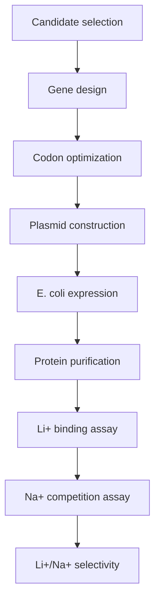

# Wet Lab

Experimental planning and results for expression, purification, and Li+/Na+ selectivity assays.

## Experimental Workflow

## Records to Keep

| Record | Folder Use |
|---|---|
| Expression conditions | Compare constructs and induction conditions |
| Purification notes | Track yield and purity |
| Binding assay data | Validate computational predictions |
| Na+ competition data | Measure selectivity directly |
