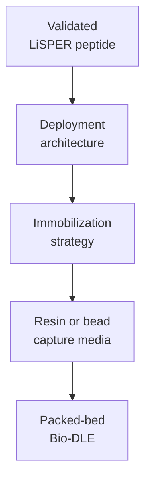

# 03 Industrial Translation

This stage contains LiSPER technology-translation studies: immobilized peptide deployment architecture, support-material analysis, packed-bed process design, and Bio-DLE reports.

## Contents

| Folder | Purpose |
|---|---|
| `deployment_architecture/` | Immobilization, support-material, and process-architecture assessment. |

The current translation hypothesis is that purified immobilized LiSPER peptide in a packed-bed column is the most realistic industrial endpoint, with inactivated display systems and magnetic beads as bridge technologies after validation.
