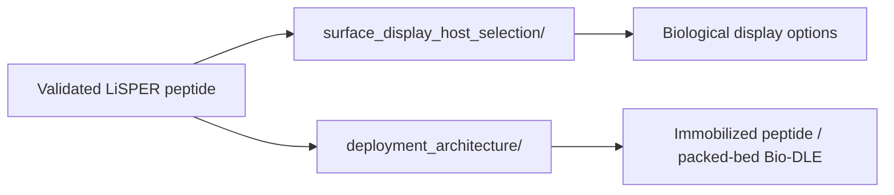

# 03 Industrial Translation

This stage contains LiSPER technology-translation studies: bacterial surface-display host selection, immobilized peptide deployment architecture, support-material analysis, and process-design reports.

## Contents

| Folder | Purpose |
|---|---|
| `surface_display_host_selection/` | Host and display-system technology assessment. |
| `deployment_architecture/` | Immobilization, support-material, and process-architecture assessment. |

The current translation hypothesis is that purified immobilized LiSPER peptide in a packed-bed column is the most realistic industrial endpoint, with inactivated display systems and magnetic beads as bridge technologies.

