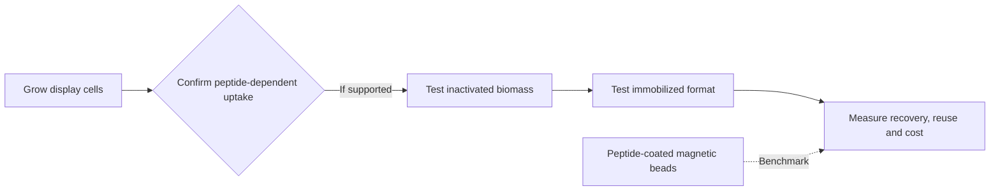

# Industrial translation

I want to find out whether bacteria can produce a **recoverable lithium bioadsorbent**. The cells would make the peptide-bearing surface. If experiments confirm lithium uptake, I would test whether inactivated cells can be immobilized and separated from treated liquid. Free cell suspension is for the initial assay; the proposed product is a recoverable material.

This is still a research direction. Before proposing industrial use, I need to measure peptide-dependent Li⁺/Na⁺ uptake, retention after inactivation and immobilization, material recovery, possible reuse, and cost per amount of lithium recovered. Peptide-coated magnetic beads are a benchmark. A column or purified-peptide material is a possible later format if measured performance and process economics support it.

The [deployment architecture reports](deployment_architecture/) record earlier options, including purified-peptide columns. Read them as historical option studies; the current experimental plan is in [02_experimental_validation](../02_experimental_validation/README.md).
