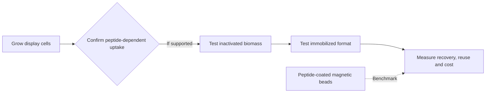

# Industrial translation

LiSPER's current product hypothesis is a **cell-produced, recoverable bioadsorbent**. Bacteria would make the peptide-bearing surface; after uptake is experimentally confirmed, inactivated display-cell material could be immobilized into a form that can be separated from treated liquid. Free cell suspension is an assay format, not the intended product.

This is a research direction, not a demonstrated industrial process. The key gates are peptide-dependent Li⁺/Na⁺ uptake, retention after inactivation and immobilization, material recovery, possible reuse, and cost per amount of lithium recovered. Peptide-coated magnetic beads are a benchmark. A column or purified-peptide material is a possible later format only if measured performance and process economics support it.

The [deployment architecture reports](deployment_architecture/) record earlier options, including purified-peptide columns. Read them as historical option studies; the current experimental plan is in [02_experimental_validation](../02_experimental_validation/README.md).
