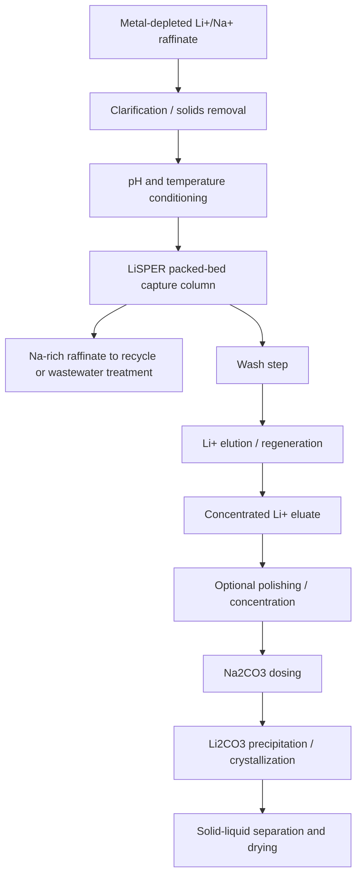

# Conceptual LiSPER Process Flow

## Recommended Process Position

LiSPER should operate before Na2CO3 addition and after upstream impurity removal/concentration sufficient to make Li capture economical.

Best insertion point:

1. Metal-depleted Li+/Na+ stream.
2. Clarification/filtration.
3. pH adjustment to LiSPER operating window.
4. Optional temperature adjustment to 20-40 C.
5. LiSPER packed-bed capture.
6. Wash to remove Na+ and weakly bound impurities.
7. Li+ elution into a smaller volume.
8. Concentrated Li+ eluate polishing if needed.
9. Na2CO3 addition and Li2CO3 precipitation.

## Conceptual Diagram

## Before or After Concentration?

Preferred: after moderate concentration but before carbonate precipitation.

- Before concentration: lower fouling and simpler chemistry, but Li may be too dilute and column volumes too large.
- After concentration: higher productivity and smaller equipment, but salt and impurity stress increase.
- Recommended compromise: use LiSPER after bulk impurity removal and enough concentration to make bed volumes practical, while avoiding hot/high-pH carbonate conditions.

## Before or After Na2CO3 Addition?

Preferred: before Na2CO3 addition.

Reasons:

- Na2CO3 strongly raises sodium, carbonate, pH, and ionic strength.
- LiSPER is intended to solve Li+/Na+ selectivity, but unnecessary sodium loading should not be added before capture.
- Carbonate precipitation conditions are hot/alkaline and hostile to peptides/cells.
- Capturing Li first enables a smaller, cleaner Li-rich eluate for conventional Li2CO3 precipitation.

## Regeneration Concept

Start with mild pH/salt swing screening:

- Load: pH 6.5-8.0, process Li/Na matrix.
- Wash: same pH, low-Li/high-Na displacement wash if selectivity allows.
- Elute: mild acid, competing cation, or ionic-strength/pH shift chosen empirically to release Li without damaging peptide/support.
- Re-equilibrate: return to loading pH.

Avoid aggressive chelators in early regeneration if the support chemistry or residual-metal management is affected.

