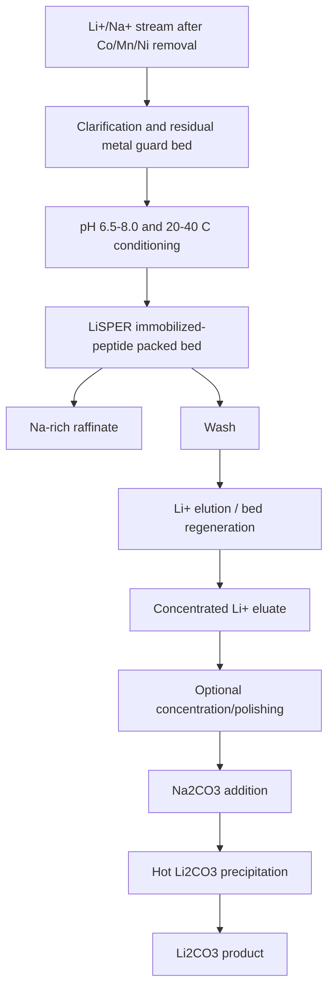

# Final LiSPER Deployment Architecture Report

## Executive Recommendation

The most realistic industrial LiSPER deployment after peptide validation is not living engineered bacteria. It is a packed-bed adsorption column containing an immobilized LiSPER ligand, preferably a purified terminally engineered peptide covalently attached to a mechanically robust acrylic/methacrylate resin.

Recommended architecture:

- Platform: packed-bed adsorption column.
- Ligand format: purified immobilized LiSPER peptide.
- Bridge format: inactivated surface-display bacteria or immobilized membrane/display fragments for lower-cost pilot learning.
- Support: epoxy-functionalized acrylic/methacrylate resin for industrial development; NHS/maleimide agarose or magnetic beads for early validation.
- Regeneration: mild pH/salt swing or competitive elution, selected experimentally to preserve ligand and support.
- Process position: after metal removal and moderate concentration, before Na2CO3 addition and Li2CO3 precipitation.

## 1. Deployment Platform Comparison

| Platform | Stability | Reusability | Cost | Regulatory burden | Scalability | Separation efficiency | Regeneration ease | Assessment |
|---|---|---:|---:|---:|---:|---:|---:|---|
| Living engineered bacteria | Low-medium | Potentially self-renewing but unstable | Low biomass cost | Very high | Medium | Variable | Difficult | Poor first industrial choice; useful for discovery. |
| Inactivated surface-display bacteria | Medium | Medium | Low-medium | Medium | Medium | Depends display density | Medium | Strong bridge from biological display to contained adsorbent. |
| Purified immobilized LiSPER peptide | High if covalently immobilized | High | Medium-high | Low-medium | High | High if orientation is controlled | High | Best industrial target after validation. |
| Membrane fragments displaying LiSPER | Medium | Medium | Medium | Medium | Medium-low | Potentially high | Medium | Interesting hybrid; manufacturing consistency risk. |
| Magnetic bead systems | Medium-high | Medium | High | Low-medium | Low-medium | High for small volumes | High | Excellent screening/pilot tool; costly for bulk streams. |
| Packed-bed adsorption columns | High | High | Medium | Low-medium | High | High with good mass transfer | High | Best process form factor. |
| Hybrid systems | Medium-high | Medium-high | Medium | Medium | Medium-high | High | Medium | Useful staged route: display discovery to immobilized peptide column. |

## 2. Recommended Deployment Platform

Use a packed-bed adsorption column containing covalently immobilized LiSPER peptide.

Why:

- It matches the established DLE/ion-exchange industrial pattern.
- It avoids live-GMO release and viability requirements.
- It enables controlled ligand density, bed-volume accounting, pressure-drop design, and regeneration-cycle testing.
- It separates peptide discovery from process engineering.
- It can feed a conventional Li2CO3 precipitation step with a smaller Li-rich eluate.

Living display should remain a discovery and low-cost production tool, not the default industrial unit.

## 3. Recommended Immobilization Strategy

Primary industrial strategy:

- Synthesize or recombinantly produce LiSPER with a nonbinding terminal handle.
- Add a hydrophilic spacer to project the Li-binding motif away from the support.
- Immobilize covalently on epoxy-functionalized acrylic/methacrylate resin.
- Screen terminal orientation: N-terminal immobilization, C-terminal immobilization, and spacer length.

Near-term validation strategy:

- Use NHS or maleimide magnetic beads/agarose to rapidly test binding and regeneration.
- Use biotin-streptavidin only for analytical validation, not as a bulk material.
- Use Ni-NTA/His-tag immobilization only for reversible lab assays; avoid as final architecture because competing metals, imidazole/pH regeneration, and nickel leakage are poor fits for battery-recycling streams.

## 4. Recommended Support Material

Industrial support:

- Epoxy-functionalized acrylic/methacrylate resin beads.

Pilot/lab supports:

- NHS or maleimide agarose beads for fast affinity-media prototyping.
- Magnetic beads for screening and batch capture measurements.
- Inactivated display-cell/polymer beads as a low-cost bridge if purified peptide resin is too expensive.

Support requirements:

- low nonspecific sodium/lithium background,
- stable in pH 5-9 loading/regeneration windows,
- compatible with high ionic strength,
- low ligand leakage,
- acceptable pressure drop,
- stable over many load/wash/elute cycles.

## 5. Recommended Regeneration Strategy

Start with a mild regeneration hierarchy:

1. pH swing elution: mildly acidic elution if LiSPER releases Li without peptide damage.
2. Salt/ionic-strength swing: useful if binding has electrostatic contribution.
3. Competitive cation elution: screen cautiously; avoid adding difficult downstream contaminants.
4. Temperature swing: lower priority because peptide/support stability and energy cost are concerns.

Regeneration success criteria:

- at least 50-100 cycles for pilot relevance,
- stable capacity,
- low ligand leakage,
- no unacceptable support fouling,
- eluate chemistry compatible with Li2CO3 precipitation.

## 6. Conceptual Industrial Process Diagram

## 7. Process Position Decision

Operate LiSPER before Na2CO3 addition.

| Option | Recommendation | Reason |
|---|---|---|
| Before concentration | Not ideal unless stream is already Li-rich | Column volumes may be too large. |
| After moderate concentration | Best | Higher productivity while still avoiding carbonate crystallizer conditions. |
| Before Na2CO3 addition | Best | Avoids unnecessary sodium/carbonate/pH burden. |
| After Na2CO3 addition | Reject for first architecture | Hot, alkaline, high-carbonate conditions are hostile and Li may already precipitate. |

## 8. Cost and Risk Discussion

Main cost drivers:

- peptide synthesis or recombinant production,
- resin cost,
- ligand loading efficiency,
- capacity per bed volume,
- regeneration lifetime,
- fouling/guard-bed requirements,
- eluent consumption and downstream compatibility.

Lowest-cost long-term architecture may not be purified peptide if ligand replacement is frequent. In that case, inactivated surface-display cells immobilized in polymer beads could become attractive. However, purified peptide resin has lower regulatory burden, cleaner quality control, and easier process validation, so it is the best first industrial architecture.

Risk ranking:

- Highest risk: live engineered bacteria in process liquor.
- Medium risk: membrane fragments and inactivated display biomass.
- Lower risk: purified immobilized peptide resin.
- Lowest technical process risk: conventional Li2CO3 precipitation downstream of LiSPER, retained unchanged.

## 9. Future Patent Opportunities

Potential patentable areas:

- LiSPER peptide sequences optimized specifically for high Na+/Li+ ratios and residual Ni/Co/Mn competition.
- Terminally immobilized LiSPER variants with spacer/linker designs that preserve Li selectivity.
- Regeneration chemistries tuned for LiSPER peptide release without ligand damage.
- Packed-bed LiSPER process architecture placed between transition-metal recovery and carbonate precipitation.
- Hybrid inactivated surface-display biomass resin for low-cost lithium polishing.
- Membrane-fragment or outer-membrane-vesicle LiSPER adsorbents.
- Guard-bed plus LiSPER-bed configurations for residual multivalent metal suppression.
- LiSPER resin cleaning and reuse protocols compatible with battery-recycling raffinates.

Patent strategy should avoid broad claims around generic peptide immobilization and instead claim LiSPER-specific sequence, orientation, spacer, regeneration, and process-placement combinations.

## 10. Development Roadmap

1. Validate LiSPER peptide binding in solution and on magnetic/NHS supports.
2. Compare N-terminal and C-terminal immobilization with 2-3 spacer lengths.
3. Test Li/Na selectivity under synthetic raffinate conditions.
4. Test residual metal interference with and without a guard bed.
5. Run batch regeneration screens.
6. Move top construct to small packed-bed resin.
7. Run breakthrough curves and 50-cycle stability.
8. Compare purified peptide resin against inactivated surface-display biomass.
9. Couple Li-rich eluate to Li2CO3 precipitation.

## Evidence Base

See:

- `notes/source_metadata.md`
- `immobilization_methods/immobilization_technology_matrix.md`
- `support_materials/support_material_selection.md`
- `process_design/conceptual_process_flow.md`

