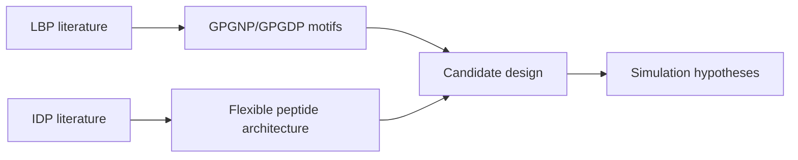

# 04 Literature

Papers and source material supporting LiSPER design logic.

## Collections

| Folder | Focus |
|---|---|
| `protein_design/IDP/` | Intrinsically disordered proteins and flexible metal-binding regions |
| `protein_design/LBP/` | Lithium-binding peptides, surface display, and lithium recovery |

Technology-translation literature reviews now live with their applied program stage:

| Folder | Focus |
|---|---|
| `../03_industrial_translation/surface_display_host_selection/` | Surface-display hosts and display platforms |
| `../03_industrial_translation/deployment_architecture/` | Immobilized peptide deployment and process architecture |

## How Literature Feeds the Project

Use this folder for PDFs, citation exports, reading notes, and evidence tables.
