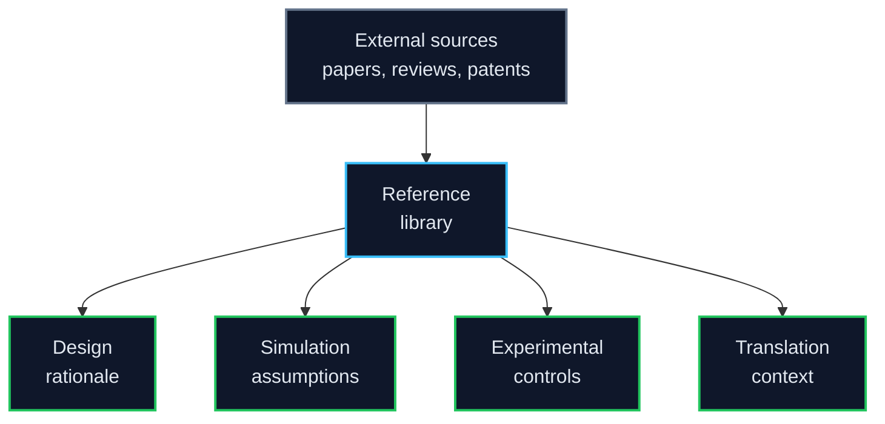
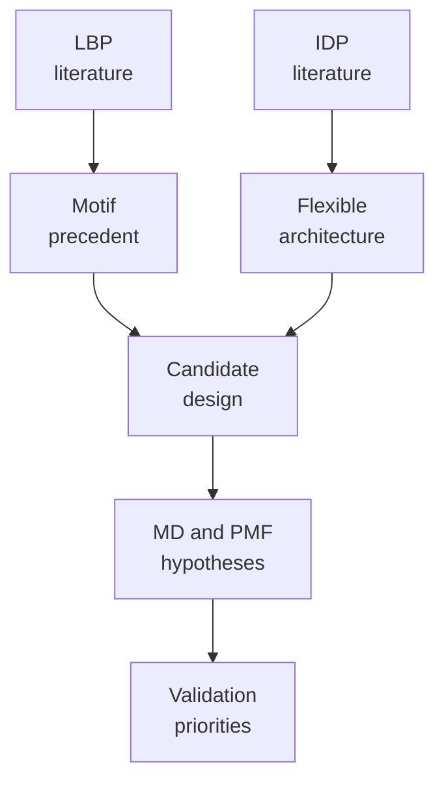

# 04 Reference Library

This folder is the **external evidence base** for LiSPER.

Use it for papers, patents, citation exports, review notes, and source metadata that support the project across multiple stages. It is not a place for generated simulation data, active wet-lab protocols, or manuscript drafts.

## Current Collections

| Folder | Focus | Used For |
|---|---|---|
| [`Track A_Peptide Assay/`](Track%20A_Peptide%20Assay/) | Ordered synthetic peptide Li⁺/Na⁺ assay literature (beads, dialysis, ICP, QC/TFA) | Designing Track A wet protocols and interpreting vendor-peptide experiments |
| [`protein_design/IDP/`](protein_design/IDP/) | Intrinsically disordered proteins and flexible metal-binding regions | Explaining LiSPER flexibility, ensemble behavior, and IDP-inspired design choices |
| [`protein_design/LBP/`](protein_design/LBP/) | Lithium-binding peptides, surface display, and lithium recovery | Motif precedent, Li-binding context, and comparison to published lithium-capture biology |

## Boundary Rule

| Material | Put It Here? | Better Location |
|---|---:|---|
| Foundational papers used by multiple stages | Yes | This folder |
| Citation exports and source metadata | Yes | This folder |
| Reading notes that summarize external literature | Yes | This folder or the relevant study folder |
| Surface-display host-selection review outputs | No | `../02_experimental_validation/track_B_surface_display/research/surface_display_host_selection/` |
| Deployment architecture review outputs | No | `../03_industrial_translation/deployment_architecture/` |
| Figures for papers, decks, or reports | No | `../05_outputs_and_communication/figures/` |
| Scripts, repo guides, or intake notes | No | `../06_project_operations/` |

## How Literature Feeds LiSPER

Keep this area source-centered: a future reader should be able to ask, "What evidence did LiSPER rely on?" and find the answer here.
