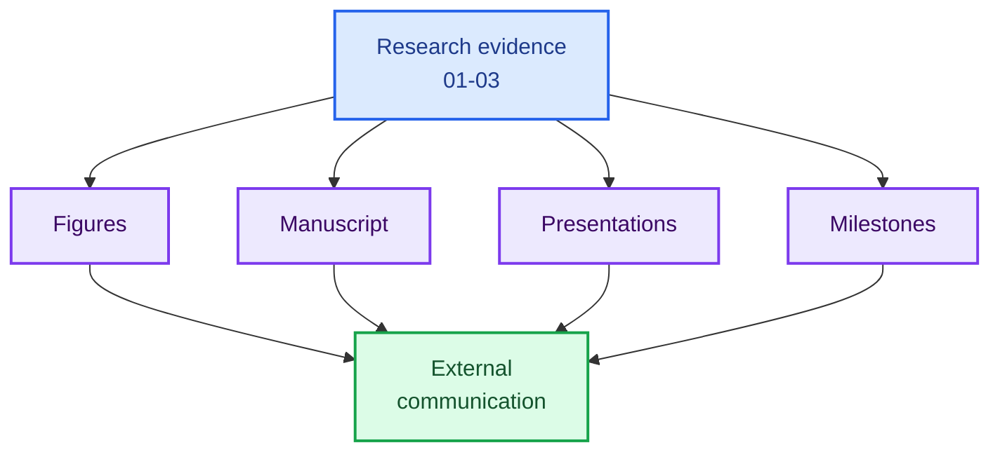

# 05 Outputs and Communication

This folder is for **materials intended to communicate LiSPER outward**: manuscripts, figures, presentations, milestone updates, and reviewer-facing summaries.

It should contain polished or semi-polished outputs derived from the research folders. Raw simulation data, wet-lab records, and literature PDFs should stay in their source folders.

## Folder Map

| Folder | Purpose |
|---|---|
| [`manuscript/`](manuscript/) | Publication-style drafts, outlines, figure captions, tables, and supplement planning |
| [`figures/`](figures/) | Exported figures, editable figure sources, visual summaries, and manuscript-ready images |
| [`presentations/`](presentations/) | Slide decks for progress reports, faculty updates, pitch reviews, and team communication |
| [`milestones/`](milestones/) | Milestone summaries, dated progress snapshots, and decision-point communication |

## Boundary Rule

| Material | Put It Here? | Better Location |
|---|---:|---|
| Manuscript outline or draft | Yes | `manuscript/` |
| Final or editable figure | Yes | `figures/` |
| Progress-report deck | Yes | `presentations/` |
| DKU reviewer or advisor summary | Yes | `milestones/` or `presentations/` |
| Raw trajectory, structure, or PMF data | No | `../01_computational_discovery/` |
| Wet-lab protocol or plasmid file | No | `../02_experimental_validation/` |
| Industrial deployment research report | No | `../03_industrial_translation/` |
| Literature PDFs | No | `../04_reference_library/` |
| Reusable scripts or repository guides | No | `../06_project_operations/` |

This is the place where LiSPER becomes understandable to people outside the day-to-day research workflow.
