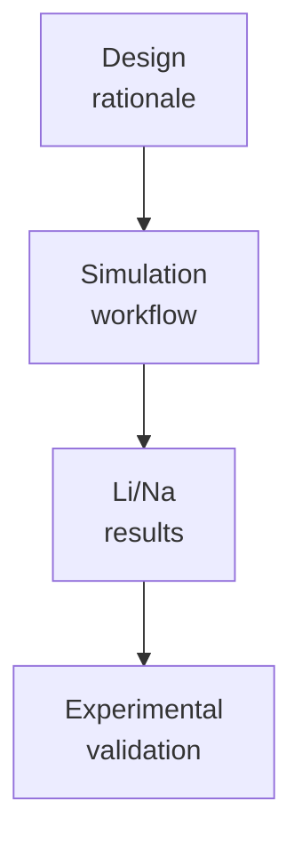

# Manuscript

Drafts, outlines, tables, figure captions, and supplementary-material planning.

## Story Arc

Use this folder for publication-style organization. Keep raw analysis and trajectories in `../../01_computational_discovery/analysis/`, `../../01_computational_discovery/md/`, `../../01_computational_discovery/umbrella/`, and `../../01_computational_discovery/pmf/`.

Decks and milestone summaries belong one level up in `../presentations/` and `../milestones/`.
