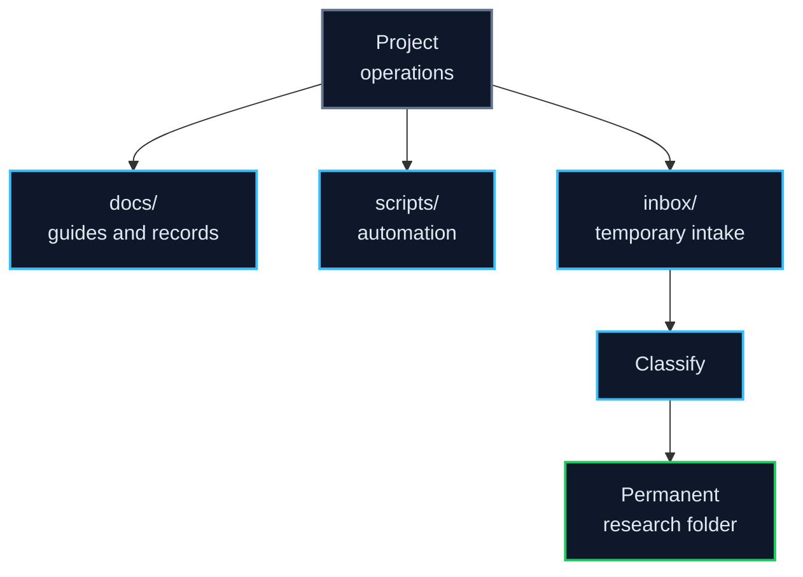

# 06 Project Operations

This folder contains the **operating system of the repository**: guides, reusable scripts, and the temporary intake area for files that still need classification.

Use it for resources that support multiple LiSPER stages. Do not use it as a general storage bucket; if a file clearly belongs to computational discovery, experimental validation, industrial translation, reference literature, or outputs, put it there instead.

## Folder Map

| Folder | Purpose |
|---|---|
| [`docs/`](docs/) | Repository guide, design rationale, workflow notes, and reorganization reports |
| [`scripts/`](scripts/) | Reusable project scripts for generation, conversion, reporting, and analysis support |
| [`inbox/`](inbox/) | Temporary drop zone for files that need classification |

## Boundary Rule

| Material | Put It Here? | Better Location |
|---|---:|---|
| Cross-project guide or decision record | Yes | `docs/` |
| Reusable script used by more than one folder | Yes | `scripts/` |
| Newly downloaded file that has not been classified | Temporarily | `inbox/` |
| Candidate simulation data | No | `../01_computational_discovery/` |
| Wet-lab protocols or assay plans | No | `../02_experimental_validation/` |
| Deployment research | No | `../03_industrial_translation/` |
| Literature PDFs | No | `../04_reference_library/` |
| Presentation decks or manuscript figures | No | `../05_outputs_and_communication/` |

The inbox should usually be empty after files are moved into the appropriate permanent folder.
