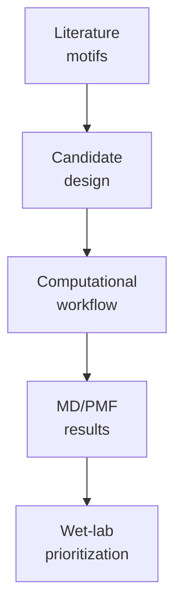

# Docs

Project-level design logic, repository guidance, and scientific decision records live here.

## Core Documents

| File | Purpose |
|---|---|
| `candidate_design_rationale.md` | Why the final 8 peptide candidates were designed |
| `repository_guide.md` | How the repository is organized |
| `repository_organization_polish_2026-06-15.md` | Why the support folders were renamed and clarified |
| `readme_polish_report_2026-06-15.md` | What changed during the repository-wide README polish pass |
| `md_to_pmf_workflow.md` | Why production MD and clustering precede umbrella sampling |

## Decision Flow

Use this folder for notes that explain choices, not for bulky raw data or generated trajectories.
