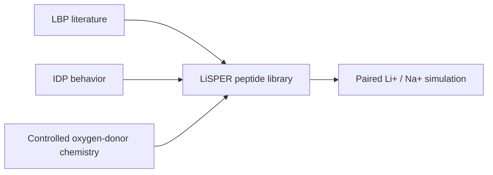

# Candidate Design Rationale

LiSPER's first-round library tests whether lithium-binding peptide motifs can be embedded in flexible, IDP-like sequence contexts to improve Li+/Na+ selectivity.

## Three Inspirations

1. Lithium-binding peptide precedent

   The LBP literature motivates the use of GPGNP and GPGDP motifs as lithium-recognition elements.

2. Intrinsically disordered peptide behavior

   Gly/Ser/Pro-rich designs are intended to avoid a rigid folded pocket and instead sample flexible ensembles that can adapt around small ions.

3. Controlled oxygen-donor chemistry

   Asp/Glu and backbone/side-chain oxygen donors may support Li+ coordination, but excessive negative charge may increase nonspecific Na+/Ca2+ binding.

## Final 8-Candidate Library

| Rank | Name | Sequence | Main design logic | Prediction | Recommended start |
| --- | --- | --- | --- | --- | --- |
| 1 | LiD3-Core | GPGDPGPGDPGPGDP | Linker-free GPGDP trimer based on the Korean Pep-D3 benchmark. | Strong compact benchmark | Yes |
| 2 | LiD3-Flex | GPGDPGSGPGDPGSGPGDP | Flexible GSG-spaced GPGDP trimer retained from the old library. | Strong flexible candidate | Yes |
| 3 | LiND-Hybrid | GPGNPGSGPGDPGSGPGNP | Mixed GPGNP/GPGDP donor environment retained from the old library. | Balanced affinity/selectivity | Yes |
| 4 | LiLC-1 | GPGDPGSGNPGSGDP | Lower-charge mixed-donor control retained from the old library. | Selectivity risk-control | Yes |
| 5 | LiDS-1 | DGDGPGDPGDG | Asp/Gly spacing probe for compact oxygen-donor geometry. | Mechanistic Li+/Na+ geometry probe | No |
| 6 | LiDA-1 | DADGPGDPDAG | Ala-supported Asp pocket probe for partial preorganization. | Mechanistic pocket probe | No |
| 7 | LiN3-Core | GPGNPGPGNPGPGNP | Linker-free GPGNP trimer benchmark. | Neutral-amide benchmark | No |
| 8 | LiA3-Ref | GPGAPGPGAPGPGAP | Low-donor GPGAP trimer reference. | Weak reference baseline | Yes |

## Recommended Initial Subset

- LiD3-Core
- LiD3-Flex
- LiND-Hybrid
- LiLC-1
- LiA3-Ref

This subset balances a compact GPGDP benchmark, a flexible GPGDP design, a mixed-motif design, a lower-charge risk-control design, and a low-donor reference.

## Screening Principle

Every candidate should be evaluated against both Li+ and Na+.

The main metric is:

Delta Delta G = Delta G(Li+) - Delta G(Na+)

More negative Delta Delta G values indicate stronger lithium preference.

## Interpretation Map

| Observation | Possible Meaning |
|---|---|
| Strong Li+ PMF, weak Na+ PMF | Desired lithium selectivity |
| Strong Li+ and strong Na+ PMFs | Nonspecific ion binding risk |
| Weak Li+ and weak Na+ PMFs | Poor binder or useful low-donor reference behavior |
| Low top-cluster population | Highly disordered ensemble; may require multiple representatives |
