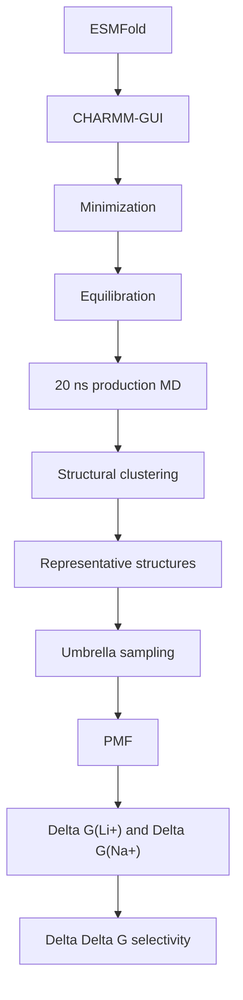

# MD to PMF Workflow

LiSPER peptides are short, Gly/Ser/Pro-rich, and intentionally flexible. Umbrella sampling should therefore start from production-MD representative structures, not directly from ESMFold or a random trajectory frame.

## Correct Path

## Why Clustering Is Required

During production MD, each peptide samples an ensemble of conformations. For IDP-like peptides, those frames can represent multiple recurrent shapes rather than one stable fold.

| Shortcut | Risk |
|---|---|
| ESMFold -> umbrella sampling | Uses one predicted conformation without ensemble evidence |
| Random production frame -> umbrella sampling | May pick a rare 1% state |
| Cluster representative -> umbrella sampling | Starts from a statistically meaningful state |

## Current Remote Implementation

| Step | Implementation |
|---|---|
| Production length | 20 ns |
| Frame output | Every 10 ps |
| Clustering tool | `gmx cluster` |
| Clustering group | `SOLU` peptide group |
| Method | GROMOS |
| Default cutoff | 0.20 nm peptide RMSD |
| Representative output | `cluster_20ns/representative_top_cluster.pdb` |
| Summary output | `production_clustering_summary.tsv` |

Low top-cluster population is not automatically bad. For LiSPER, it may be important evidence that the peptide is strongly disordered.

## PMF Entry Point

For the first PMF pass, use the representative structure from the largest production-MD cluster for each peptide and ion condition.

`Delta Delta G = Delta G(Li+) - Delta G(Na+)`

More negative Delta Delta G indicates stronger Li+ preference.
