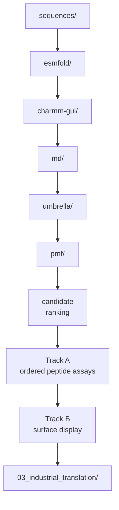
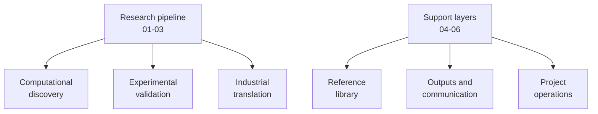
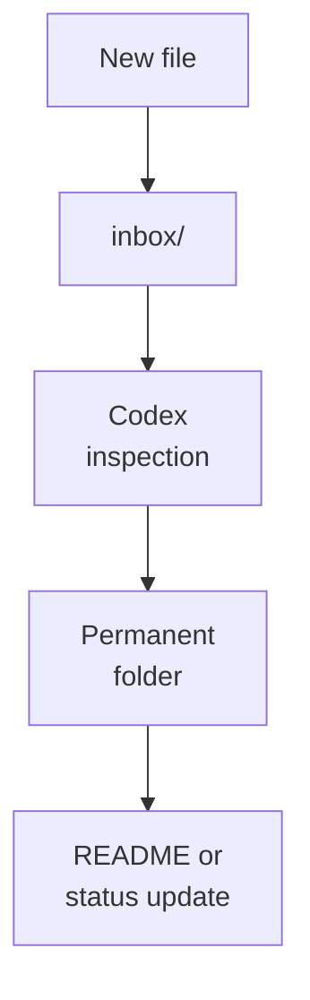

# LiSPER Repository Guide

LiSPER asks whether de novo designed, IDP-like peptides can selectively bind Li+ over Na+ in aqueous solution.

## Main Data Flow

## Organizational Model

LiSPER has three active research phases and three support layers.

Use this rule when placing new files:

- `01-03` are for doing the science.
- `04_reference_library/` is for external evidence.
- `05_outputs_and_communication/` is for communicating the science.
- `06_project_operations/` is for keeping the project usable.

## Folder Roles

| Folder | Role |
|---|---|
| `01_computational_discovery/` | Candidate design, ESMFold, CHARMM-GUI, GROMACS, umbrella sampling, PMF, data, and analysis |
| `02_experimental_validation/` | Vendor-ordered synthetic peptide binding validation and surface-display engineering |
| `03_industrial_translation/` | Immobilized peptide architecture, packed-bed process design, and Bio-DLE studies |
| `04_reference_library/` | External sources, literature PDFs, citation exports, evidence notes, and source metadata |
| `05_outputs_and_communication/` | Manuscripts, figures, presentations, milestone summaries, and reviewer-facing outputs |
| `06_project_operations/` | Cross-project guides, reusable scripts, decision records, and temporary inbox |
| `assets/` | Branding assets and reusable non-data media |
| `archive/` | Superseded or non-current materials preserved for history |

## Naming Convention

Use candidate IDs exactly as listed in `01_computational_discovery/sequences/candidates.tsv`.

| Rank | Candidate |
|---:|---|
| 1 | `LiD3-Core` |
| 2 | `LiD3-Flex` |
| 3 | `LiND-Hybrid` |
| 4 | `LiLC-1` |
| 5 | `LiDS-1` |
| 6 | `LiDA-1` |
| 7 | `LiN3-Core` |
| 8 | `LiA3-Ref` |

Ion-specific folders should include the condition, for example `LiD3-Core_LiCl` or `LiD3-Core_NaCl`.

## Inbox Workflow

The active inbox lives at repository-level `inbox/` and should stay mostly empty after processing. Permanent project files should live in the relevant stage folder.

## Design Logic

The first-round library links three ideas:

- GPGDP/GPGNP motifs provide lithium-binding precedent.
- Gly/Ser/Pro-rich sequence design provides IDP-like flexibility.
- Asp/Glu oxygen donors may coordinate ions, while limited charge reduces nonspecific binding risk.

Every candidate is evaluated against both Li+ and Na+, including the low-donor reference.
