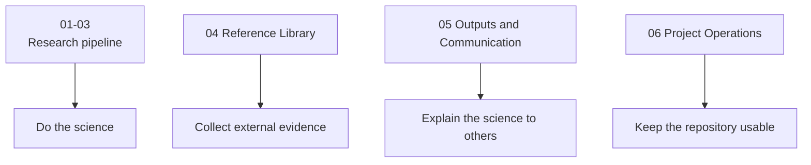

# Repository Organization Polish

Date: 2026-06-15

## Reasoning

The first repository reorganization successfully separated LiSPER into the three major research phases:

1. Computational Discovery
2. Experimental Validation
3. Industrial Translation

However, the remaining support folders still felt ambiguous. In particular, `04_literature`, `05_manuscript`, and `06_shared` were easy to confuse because their names described file types or vague sharing rather than their role in the research program.

The updated structure makes the boundaries explicit:

## What Changed

| Previous folder | New folder | Reason |
|---|---|---|
| `04_literature/` | `04_reference_library/` | Clarifies that this folder is the external evidence base, not every literature-derived report. |
| `05_manuscript/` | `05_outputs_and_communication/` | Expands the scope beyond manuscripts to include figures, presentations, milestone summaries, and reviewer-facing materials. |
| `06_shared/` | `06_project_operations/` | Replaces a vague shared bucket with a clearer home for guides, scripts, decision records, and the intake inbox. |
| `05_outputs_and_communication/LiSPER_Progress_Report.pptx` | `05_outputs_and_communication/presentations/LiSPER_Progress_Report.pptx` | Places the progress deck in the communication-output subfolder where slide decks belong. |

## Active Folder Logic

| Folder | Plain-language rule |
|---|---|
| `01_computational_discovery/` | Put computational inputs, generated structures, simulations, analysis, and PMF work here. |
| `02_experimental_validation/` | Put plasmids, protocols, purified-peptide validation, and surface-display validation here. |
| `03_industrial_translation/` | Put immobilization, process design, deployment architecture, and Bio-DLE translation studies here. |
| `04_reference_library/` | Put external sources and literature evidence here. |
| `05_outputs_and_communication/` | Put materials meant to communicate LiSPER to readers, reviewers, advisors, collaborators, or investors here. |
| `06_project_operations/` | Put repository guides, reusable scripts, project-level decision records, and temporary intake files here. |
| `assets/` | Put reusable non-data media and branding assets here. |
| `archive/` | Put superseded, obsolete, or non-current materials here instead of deleting them. |

## Documentation Updated

- Root `README.md` now explains the repository as a research pipeline plus support layers.
- `04_reference_library/README.md` now defines what belongs in the evidence base.
- `05_outputs_and_communication/README.md` now separates manuscripts, figures, presentations, and milestones.
- `06_project_operations/README.md` now defines operations as guides, scripts, and temporary intake.
- `06_project_operations/docs/repository_guide.md` now includes the updated organizational model.

## Why This Is Better

- The folder names now describe purpose, not just file type.
- Literature-derived research reports can live with the phase they support, while source papers remain in the reference library.
- Manuscripts, decks, milestone reports, and figures now share one communication area.
- Scripts and repository guides no longer sit in a vague shared bucket.
- The top-level structure is easier to explain to new students, advisors, reviewers, and collaborators.
