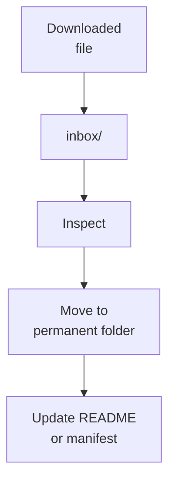

# Inbox

Temporary drop zone for files that need classification.

## Put Here

| File Type | Final Destination Usually |
|---|---|
| New papers | `04_reference_library/` or a study folder under `03_industrial_translation/` |
| CHARMM-GUI archives | `01_computational_discovery/charmm-gui/<condition>/` |
| ESMFold downloads | `01_computational_discovery/esmfold/` |
| Track A plasmid/vector files | `02_experimental_validation/track_A_purified_peptide/plasmids/` |
| Track B plasmid/vector files | `02_experimental_validation/track_B_surface_display/plasmids/` |
| Screenshots | `05_outputs_and_communication/figures/` or condition metadata |
| One-off notes | `06_project_operations/docs/`, the relevant track `protocols/`, or `05_outputs_and_communication/manuscript/` |

This folder should usually be empty after processing.

If a file belongs to communication rather than active research, move it to `05_outputs_and_communication/`. If it is a reusable visual or brand asset rather than a data figure, move it to `assets/`.
