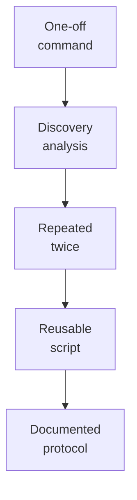

# Scripts

Reusable project scripts for preparation, conversion, analysis, plotting, and reporting.

## Promotion Rule

Keep scripts small, named by task, and parameterized enough to reuse across candidates and ion conditions.
