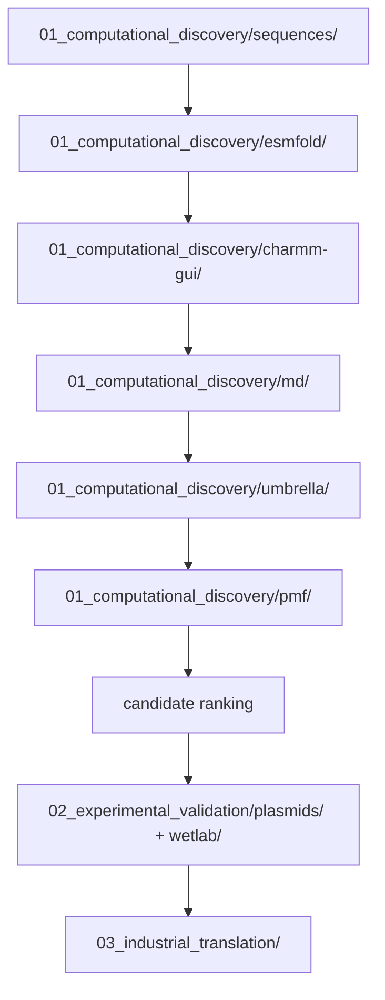

# LiSPER Repository Guide

LiSPER asks whether de novo designed, IDP-like peptides can selectively bind Li+ over Na+ in aqueous solution.

## Main Data Flow

## Folder Roles

| Folder | Role |
|---|---|
| `01_computational_discovery/` | Candidate design, ESMFold, CHARMM-GUI, GROMACS, umbrella sampling, PMF, data, and analysis |
| `02_experimental_validation/` | Plasmids, wet-lab planning, expression, purification, surface-display validation, binding assays, and protocols |
| `03_industrial_translation/` | Immobilized peptide architecture, packed-bed process design, and Bio-DLE studies |
| `04_literature/` | Foundational protein-design literature |
| `05_manuscript/` | Manuscript drafts and figures |
| `06_shared/` | Cross-project docs, scripts, and temporary inbox |
| `archive/` | Superseded or non-current materials preserved for history |

## Naming Convention

Use candidate IDs exactly as listed in `01_computational_discovery/sequences/candidates.tsv`.

| Rank | Candidate |
|---:|---|
| 1 | `LiD3-1` |
| 2 | `LiND-1` |
| 3 | `IDP-Li-1` |
| 4 | `IDP-Li-2` |
| 5 | `LowCharge-Li` |
| 6 | `LiD2-IDP` |
| 7 | `StrongBind-Li` |
| 8 | `SoftCage-Li` |
| 9 | `IDP-Rich-Li` |
| 10 | `Control-Negative` |

Ion-specific folders should include the condition, for example `LiD3-1_LiCl` or `LiD3-1_NaCl`.

## Inbox Workflow

The inbox now lives at `06_shared/inbox/` and should stay mostly empty after processing. Permanent project files should live in the relevant stage folder.

## Design Logic

The first-round library links three ideas:

- GPGDP/GPGNP motifs provide lithium-binding precedent.
- Gly/Ser/Pro-rich sequence design provides IDP-like flexibility.
- Asp/Glu oxygen donors may coordinate ions, while limited charge reduces nonspecific binding risk.

Every candidate is evaluated against both Li+ and Na+, including the negative control.
