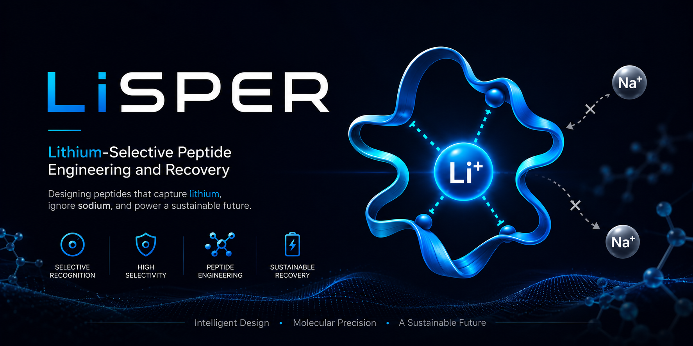
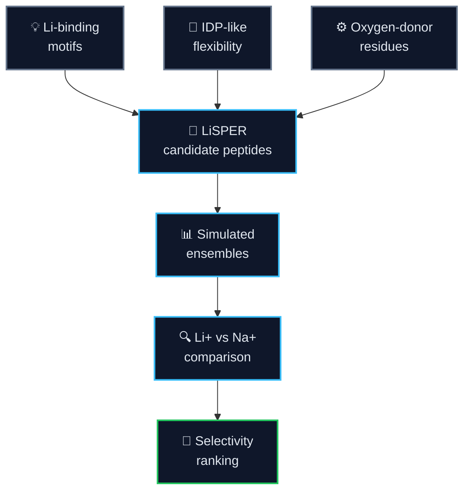
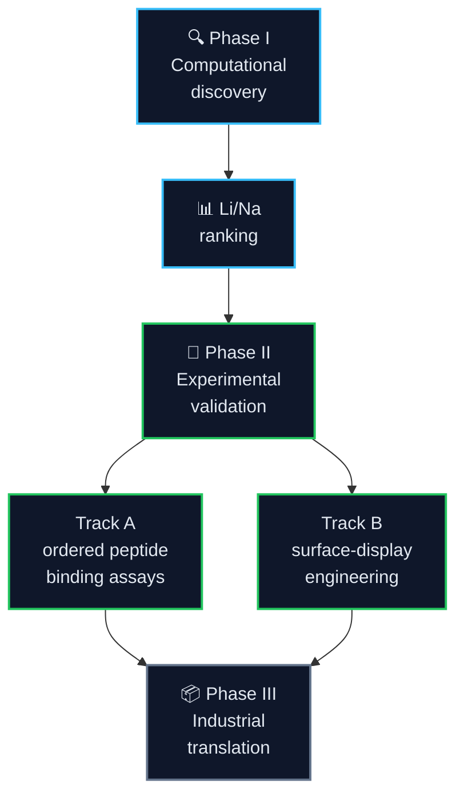
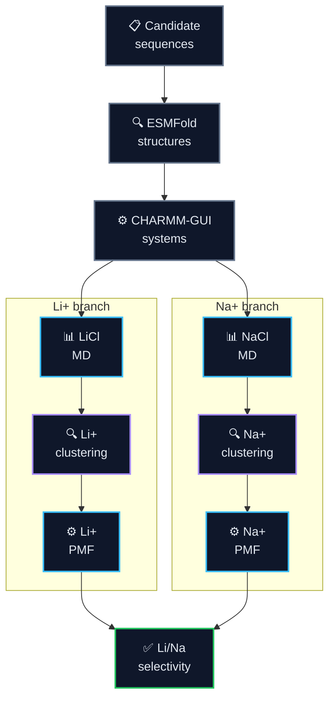
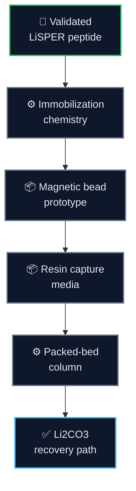
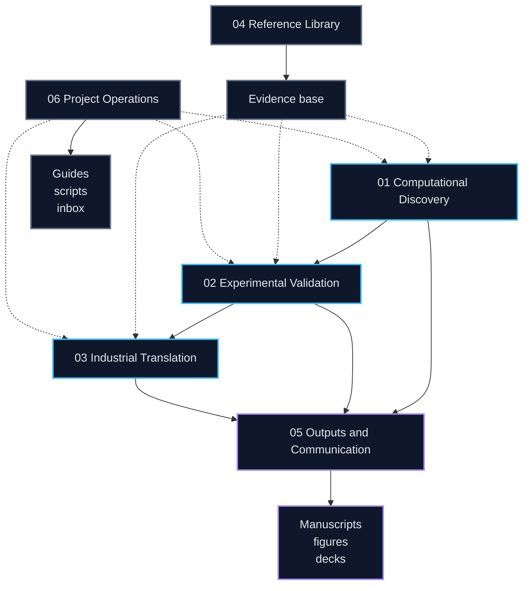

  

<h1 align="center">LiSPER</h1>

  <strong>Lithium-Selective Peptide Engineering and Recovery</strong> 
  A computational-to-experimental program for designing lithium-selective peptides and translating them toward bio-inspired Direct Lithium Extraction (Bio-DLE).

  
  
  
  
  

---

## 📋 Project overview

**LiSPER** is a scientific research and technology-development project for engineering short peptide systems that preferentially recognize lithium over sodium in aqueous environments.

The project combines **lithium-binding peptide inspiration**, **intrinsically disordered peptide principles**, and **computational protein engineering** to discover candidate Li+/Na+ selective peptide materials. The long-term aim is a deployable peptide-enabled lithium capture platform for battery recycling and Direct Lithium Extraction.

The repository now follows a clear program model:

- `01-03` are the active research pipeline.
- `04-06` are support layers for evidence, communication, and operations.
- `assets/` stores reusable branding and media.
- `archive/` preserves non-current material without presenting it as active work.

| What LiSPER is | Why it matters | Current focus |
|---|---|---|
| Lithium-selective peptide library | Li+/Na+ separation is central to lithium recovery | Final 8-candidate intake |
| Computational discovery engine | Prioritizes candidates before wet-lab cost | Full LiCl/NaCl MD setup gate |
| Experimental validation program | Converts predictions into measurable assays | Ordered synthetic peptide binding first, then surface display |
| Bio-DLE translation roadmap | Connects molecular recognition to process design | Immobilized peptide capture concepts |

## 🎯 Scientific thesis

> **Flexible peptide motifs with oxygen-donor residues can form lithium coordination environments that differ measurably from sodium coordination under aqueous conditions.**

LiSPER does not only ask whether a peptide can bind Li+. It asks whether a peptide can prefer Li+ over Na+, and whether that preference can be carried from molecular simulation into experimental and eventually material formats.

## 🧭 Program roadmap

LiSPER is organized as a three-stage program: discover the molecular principle, validate it experimentally, then translate the best peptide systems into capture materials.

| Phase | Goal | Status | Near-term gate |
|---|---|---|---|
| **I. Computational discovery** | Rank LiSPER candidates by Li+/Na+ selectivity | Active | Finish production MD, clustering, umbrella sampling, PMF |
| **II. Experimental validation** | Test whether designed peptides show measurable selectivity | Preparing | Order synthetic peptides, run Li/Na binding assays, then build surface-display constructs |
| **III. Industrial translation** | Convert validated peptides into capture media | Concept stage | Select immobilization and column prototype strategy |

## 📊 Progress monitor dashboard

> [!IMPORTANT]
> **Scientific steward snapshot: 2026-07-13 21:13 CST.** Formal peptide production remains stopped with checkpoints preserved. The primary redesign separates standard Li affinity (double-decoupling ABFE), Li-over-Na selectivity (matched site/bulk Li-to-Na alchemical cycles), and kinetics. Three refined 14-state bulk replicas completed all 42 windows without fatal/LINCS evidence and materially improved endpoint state support. Their finite-box LiCl-to-NaCl values and hydration structures are method evidence, not peptide selectivity results; Li first-shell coordination remains a force-field-model concern requiring sensitivity tests.
>
> 
> 
> 
> 
> 
> 
> 

  <a href="https://jackyissocute.github.io/LiSPER-Dashboard/"><strong>Open LiSPER Dashboard</strong></a>

**Last synchronized monitor snapshot:** `2026-07-13 21:13 CST`

<strong>Dashboard legend</strong>

Status: 🟢 complete, 🔵 running, 🟡 held, 🟣 method review, 🔺 warning, ⚫ planned. Ion accents: LiCl `#818CF8`, NaCl `#2DD4BF`.

Umbrella stages: `Prep -> Pull -> Windows -> Umbrella MD -> QC`. Dot position = stage; color/shape = status. `◆` marks QC.

Active compute: bulk Li-to-Na alchemical method validation on a 128-thread EPYC 9554P worker; peptide production is stopped.

### Process Matrix

<table>
  <thead>
    <tr>
      <th>Track</th>
      <th>Process</th>
      <th>Progress</th>
      <th>Status</th>
    </tr>
  </thead>
  <tbody>
    <tr>
      <td><strong>Compute</strong></td>
      <td>Worker slots in use</td>
      <td><code>🟡 0 active / 124 capacity</code> 42 refined validation windows complete; next model tests being specified</td>
      <td></td>
    </tr>
    <tr>
      <td rowspan="2"><strong>LiCl</strong></td>
      <td>20 ns production MD</td>
      <td><code>🟢 8/8</code></td>
      <td></td>
    </tr>
    <tr>
      <td>Structural clustering</td>
      <td><code>🟢 8/8 reps</code></td>
      <td></td>
    </tr>
    <tr>
      <td rowspan="2"><strong>NaCl</strong></td>
      <td>20 ns production MD</td>
      <td><code>🔺 8/8 historical; 7/8 require rebuild</code></td>
      <td></td>
    </tr>
    <tr>
      <td>Structural clustering</td>
      <td><code>🔺 8/8 historical reps; 7/8 unusable</code></td>
      <td></td>
    </tr>
    <tr>
      <td rowspan="2"><strong>Free energy</strong></td>
      <td>Umbrella windows</td>
      <td><code>🔺 LiLC-1 stopped · Na topology invalid · reaction coordinate permits off-site rebinding</code></td>
      <td></td>
    </tr>
    <tr>
      <td>WHAM / PMF / ΔG</td>
      <td><code>🟣 old verdict retired · estimator/uncertainty/overlap/replica review</code></td>
      <td></td>
    </tr>
  </tbody>
</table>

### Protein Matrix

Stage glyphs: 🟢 complete, 🔵 running, 🟡 queued, 🟣 QC, 🔺 repair/warning, ⚫ planned, ◆ QC stage. Order: Prep / Pull / Windows / Umbrella MD / QC.

<table>
  <thead>
    <tr>
      <th>Protein</th>
      <th>LiCl</th>
      <th>NaCl</th>
      <th>Umbrella</th>
      <th>PMF</th>
    </tr>
  </thead>
  <tbody>
    <tr>
      <td><strong>LiD3-Core</strong></td>
      <td><code>20 ns</code> 🟢 rep 12.69%</td>
      <td><code>20 ns</code> 🟢 rep 10.34%</td>
      <td><code>LiCl geometry screened</code> 🟢 ⚫ ⚫ ⚫ ◆⚫ <code>NaCl geometry screened</code> 🟢 ⚫ ⚫ ⚫ ◆⚫</td>
      <td></td>
    </tr>
    <tr>
      <td><strong>LiD3-Flex</strong></td>
      <td><code>20 ns</code> 🟢 rep 4.40%</td>
      <td><code>20 ns</code> 🟢 rep 3.80%</td>
      <td><code>LiCl geometry screened</code> 🟢 ⚫ ⚫ ⚫ ◆⚫ <code>NaCl geometry screened</code> 🟢 ⚫ ⚫ ⚫ ◆⚫</td>
      <td></td>
    </tr>
    <tr>
      <td><strong>LiND-Hybrid</strong></td>
      <td><code>20 ns</code> 🟢 rep 12.89%</td>
      <td><code>20 ns</code> 🟢 rep ready</td>
      <td><code>LiCl geometry screened</code> 🟢 ⚫ ⚫ ⚫ ◆⚫ <code>NaCl geometry screened</code> 🟢 ⚫ ⚫ ⚫ ◆⚫</td>
      <td></td>
    </tr>
    <tr>
      <td><strong>LiLC-1</strong></td>
      <td><code>20 ns</code> 🟢 rep 4.15%</td>
      <td><code>20 ns</code> 🟢 rep 1.95%</td>
      <td><code>LiCl diagnostic stopped: off-site rebinding</code> 🟢 🟢 🟢 🔺 ◆🟣 <code>NaCl invalid topology: rebuild required</code> 🔺 ⚫ ⚫ ⚫ ◆⚫</td>
      <td></td>
    </tr>
    <tr>
      <td><strong>LiDS-1</strong></td>
      <td><code>20 ns</code> 🟢 rep 15.69%</td>
      <td><code>20 ns</code> 🟢 rep 14.59%</td>
      <td><code>LiCl geometry screened</code> 🟢 ⚫ ⚫ ⚫ ◆⚫ <code>NaCl geometry screened</code> 🟢 ⚫ ⚫ ⚫ ◆⚫</td>
      <td></td>
    </tr>
    <tr>
      <td><strong>LiDA-1</strong></td>
      <td><code>20 ns</code> 🟢 rep 17.64%</td>
      <td><code>20 ns</code> 🟢 rep 17.94%</td>
      <td><code>LiCl geometry screened</code> 🟢 ⚫ ⚫ ⚫ ◆⚫ <code>NaCl geometry screened</code> 🟢 ⚫ ⚫ ⚫ ◆⚫</td>
      <td></td>
    </tr>
    <tr>
      <td><strong>LiN3-Core</strong></td>
      <td><code>20 ns</code> 🟢 rep 4.65%</td>
      <td><code>20 ns</code> 🟢 rep 11.44%</td>
      <td><code>LiCl geometry screened</code> 🟢 ⚫ ⚫ ⚫ ◆⚫ <code>NaCl geometry screened</code> 🟢 ⚫ ⚫ ⚫ ◆⚫</td>
      <td></td>
    </tr>
    <tr>
      <td><strong>LiA3-Ref</strong></td>
      <td><code>20 ns</code> 🟢 rep 5.05%</td>
      <td><code>20 ns</code> 🟢 rep 7.35%</td>
      <td><code>LiCl geometry screened</code> 🟢 ⚫ ⚫ ⚫ ◆⚫ <code>NaCl geometry screened</code> 🟢 ⚫ ⚫ ⚫ ◆⚫</td>
      <td></td>
    </tr>
  </tbody>
</table>

### Remaining-time horizon

<table>
  <thead>
    <tr>
      <th>Gate</th>
      <th>Time remaining</th>
      <th>What clears the gate</th>
    </tr>
  </thead>
  <tbody>
    <tr>
      <td><strong>Setup QC completion</strong></td>
      <td align="center"><strong><code>AUDIT REOPENED</code></strong> published Na NBFIX provenance is now enforced</td>
      <td>Regenerate and hash affected Na topologies; compile without suppressed warnings.</td>
    </tr>
    <tr>
      <td><strong>20 ns production + clustering</strong></td>
      <td align="center"><strong><code>AUDIT REOPENED</code></strong> 7/8 Na trajectories and representatives require rebuild</td>
      <td>Rebuild the seven affected Na stages under corrected, pinned topologies; LiDA-1 contains both audited NBFIX terms.</td>
    </tr>
    <tr>
      <td><strong>Umbrella sampling</strong></td>
      <td align="center"><strong><code>METHOD REVIEW</code></strong> 42 refined bulk windows complete; zero peptide production jobs</td>
      <td>Resolve Li hydration-model sensitivity, then test ion--acetate and ion--amide competition before any peptide-site calculation.</td>
    </tr>
    <tr>
      <td><strong>WHAM / PMF / ΔG extraction</strong></td>
      <td align="center"><strong><code>METHOD REVIEW</code></strong> Old numerical verdict and heuristic regions retired</td>
      <td>Use IACT-aware WHAM, explicit overlap evidence, physical state declarations, trajectory bootstrap, time blocks, and independent-replica variation.</td>
    </tr>
    <tr>
      <td><strong>First supported selectivity table</strong></td>
      <td align="center"><strong><code>No defensible ETA yet</code></strong> Claim scope and replica plan must be resolved before scale-up</td>
      <td>Publish only the estimand supported by the coordinate, restraints, state definitions, uncertainty, and replication evidence.</td>
    </tr>
  </tbody>
</table>

> No Delta G is promoted while `DELTA_G_PROMOTION_HOLD.md` is active. A script cannot release the hold; the estimand, state definitions, correlation/overlap evidence, uncertainty, sensitivity, and independent-replica evidence require documented review.

<strong>Current MD interpretation</strong>

- LiCl minimization and equilibration are complete for all eight candidates.
- Historical NaCl setup exists for all eight candidates; seven paths omitted the audited NBFIX terms and require rebuild, while LiDA-1 contains both terms.
- LiCl production/clustering are preserved as diagnostics; seven affected Na production/clustering paths cannot support claims.
- Active compute: remote 128-thread EPYC 9554P worker.
- All eight candidates passed a geometry-only start-distance screen; this is not binding validation.
- LiLC-1 production is stopped: the Na force field must be rebuilt and the current reaction coordinate permits off-site rebinding; the remaining candidates are held during method review.
- All eight LiCl and all eight NaCl CHARMM-GUI systems are GROMACS-ready.

## 🧪 Candidate library

The active LiSPER library contains 8 candidates selected from the updated LBP, IDP, and Li+ coordination design logic. Historical paired systems exist for all eight candidates, but the Na topology provenance and the umbrella reaction coordinate are under correction; no final production or PMF claim is currently authorized.

| Rank | Candidate | Sequence | Design role | Current MD status |
|---:|---|---|---|---|
| 1 | **LiD3-Core** | `GPGDPGPGDPGPGDP` | Linker-free GPGDP trimer benchmark | Refined LiCl/NaCl V2 `14/27`, production `014-015` |
| 2 | **LiD3-Flex** | `GPGDPGSGPGDPGSGPGDP` | Flexible GSG-spaced GPGDP trimer | V3 paired guard repair: LiCl `25/30` with base `025-026` active and guards queued; NaCl `27/30` with guard `027` active |
| 3 | **LiND-Hybrid** | `GPGNPGSGPGDPGSGPGNP` | Mixed GPGNP/GPGDP donor environment | LiCl V2 `2/27`, production `002`; NaCl V2 `4/27`, production `004-005` |
| 4 | **LiLC-1** | `GPGDPGSGNPGSGDP` | Lower-charge selectivity-control design | LiCl V2 `5/27`, production `005, 026`; NaCl `V2 14/27`, production `014-015, 026` |
| 5 | **LiDS-1** | `DGDGPGDPGDG` | Asp/Gly Li+/Na+ geometry probe | Paired V2 `27/27` windows complete; LiCl WHAM/bootstrap and NaCl WHAM both in QC review |
| 6 | **LiDA-1** | `DADGPGDPDAG` | Ala-supported Asp pocket probe | LiCl `V4 27/27`, V4 WHAM/bootstrap finite but still in repair-focused QC review; NaCl V4 safe-boundary PMF diagnostic numeric-screen pass, manual region review required |
| 7 | **LiN3-Core** | `GPGNPGPGNPGNP` | GPGNP trimer benchmark | LiCl V2 `5/27`, production `005, 026`; NaCl `V2 14/27`, equilibration `014-015`, production `026` |
| 8 | **LiA3-Ref** | `GPGAPGPGAPGPGAP` | Low-donor GPGAP reference | LiCl V2 `5/27`, windows `005, 026` active; NaCl `V2 14/27`, windows `014-015, 026` active |

## ⚙️ Computational workflow

The computational pipeline is ensemble-aware because these peptides are short, flexible, and IDP-like. A single ESMFold structure is treated as a starting model, not as the final biological state.

<strong>Why structural clustering is central</strong>

LiSPER peptides are expected to sample many conformations during production MD. Structural clustering asks which conformations occur most often, then selects representative structures from populated states. This prevents umbrella sampling from starting from an arbitrary rare frame and makes the downstream PMF comparison more defensible.

---

## 🔬 Experimental validation

Phase II is designed to convert computational rankings into measurable biological evidence.

| Route | What it tests | Planned readout |
|---|---|---|
| **Track A: ordered synthetic peptide binding** | Intrinsic LiSPER binding behavior and computational validation | Li+ binding, Na+ competition, selectivity trend, PMF agreement |
| **Track B: surface-display engineering** | LiSPER as biological capture interface | Display level, whole-cell Li capture, Na rejection, regeneration |

The first wet-lab gate is commercial peptide purchase, not plasmid expression. Order synthetic LiSPER peptides from GenScript or another reliable China peptide vendor, measure Li+/Na+ binding directly, compare experimental ranking with computational PMF predictions, then use the best candidates for the main surface-display program.

## 🏭 Industrial outlook

The long-term deployment concept is an immobilized peptide capture process rather than a free peptide in solution.

**Vision:** LiSPER peptides -> Li+/Na+ selectivity -> experimental validation -> immobilized peptide systems -> peptide-enabled Direct Lithium Extraction.

## 📍 Repository navigation

The repository is organized as a research pipeline plus support layers. Folders `01-03` hold the active scientific program, while folders `04-06` hold references, communication outputs, and project operations.

| Directory | Purpose |
|---|---|
| [`01_computational_discovery/`](01_computational_discovery/) | Candidate sequences, ESMFold structures, CHARMM-GUI systems, MD, umbrella sampling, PMF, and analysis |
| [`02_experimental_validation/`](02_experimental_validation/) | Vendor-ordered synthetic peptide binding validation, surface-display engineering, and assay protocols |
| [`03_industrial_translation/`](03_industrial_translation/) | Immobilized capture formats, packed-bed process design, and deployment architecture |
| [`04_reference_library/`](04_reference_library/) | External evidence base: papers, patents, source metadata, citation exports, and reading notes |
| [`05_outputs_and_communication/`](05_outputs_and_communication/) | Manuscripts, figures, presentations, milestone summaries, and reviewer-facing materials |
| [`06_project_operations/`](06_project_operations/) | Repository guides, reusable scripts, decision records, and temporary intake inbox |
| [`assets/`](assets/) | Official LiSPER branding assets and reusable non-data media |
| [`archive/`](archive/) | Superseded working materials kept outside the active workflow |

## 🔗 Key project documents

- [Repository guide](06_project_operations/docs/repository_guide.md)
- [Candidate design rationale](06_project_operations/docs/candidate_design_rationale.md)
- [MD to PMF workflow](06_project_operations/docs/md_to_pmf_workflow.md)
- [Ordered synthetic peptide binding plan](02_experimental_validation/track_A_purified_peptide/planning/ordered_synthetic_peptide_binding_plan.md)
- [Track A vendor peptide order checklist](02_experimental_validation/track_A_purified_peptide/ordering/vendor_peptide_order_checklist.md)
- [Surface-display optimization plan](02_experimental_validation/track_B_surface_display/planning/integrated_surface_display_optimization_plan.md)
- [LiCl MD status](01_computational_discovery/md/li_cl/remote_runs/remote_status.md)
- [NaCl MD status](01_computational_discovery/md/na_cl/remote_runs/remote_status.md)
- [Surface-display host selection report](02_experimental_validation/track_B_surface_display/research/surface_display_host_selection/reports/final_host_selection_report.md)
- [Deployment architecture report](03_industrial_translation/deployment_architecture/reports/final_deployment_architecture_report.md)
- [Repository reorganization report](06_project_operations/docs/repository_reorganization_report.md)
- [README polish report](06_project_operations/docs/readme_polish_report_2026-06-15.md)
- [Branding assets](assets/branding/README.md)

## 📈 Research vision

LiSPER is meant to become more than a peptide list. It is a staged research program for discovering whether selective ion recognition can be engineered into compact, experimentally tractable peptide materials.

If successful, the platform could support:

- selective Li+/Na+ separation in battery-recycling streams
- peptide-based polishing after upstream transition-metal removal
- immobilized Bio-DLE media for lithium-bearing aqueous streams
- broader design principles for peptide-enabled ion separations

---

  <strong>LiSPER asks a simple hard question:</strong> 
  Can engineered peptide ensembles make lithium recovery more selective, biological, and modular?

