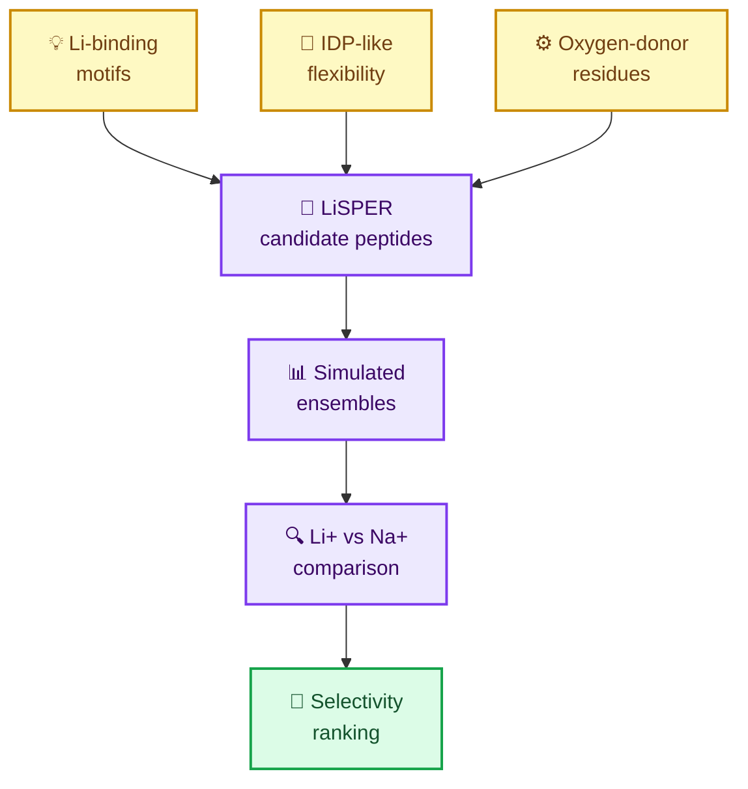
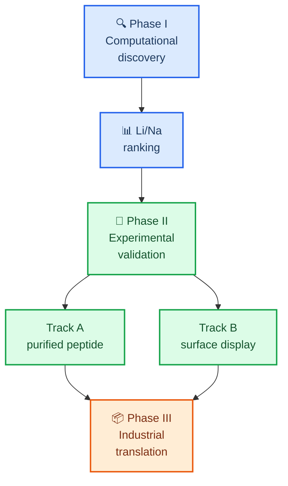
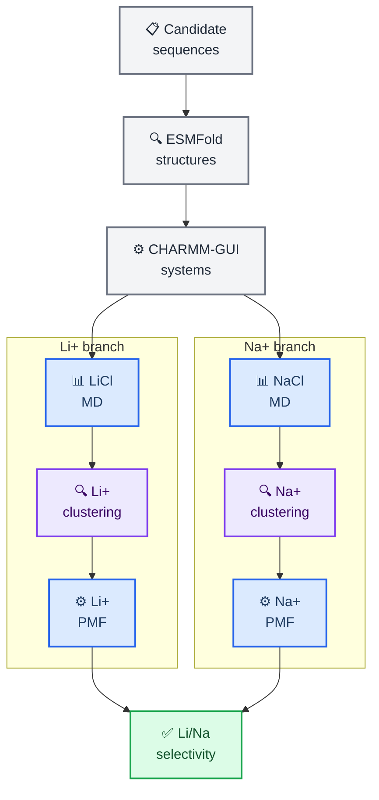
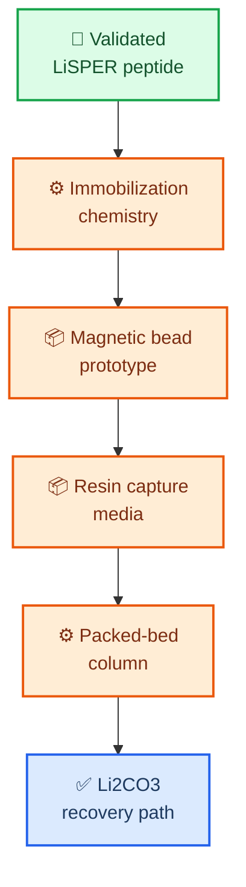
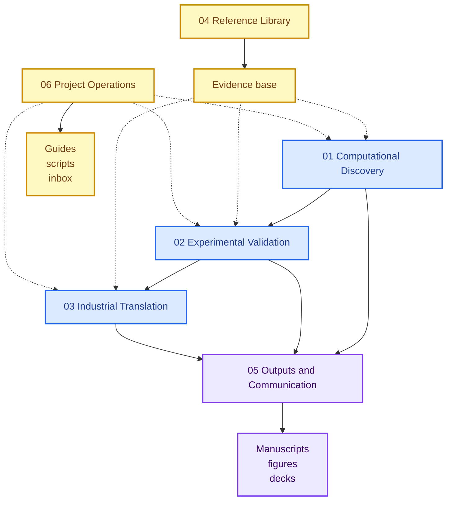

  

<h1 align="center">LiSPER</h1>

  <strong>Lithium-Selective Peptide Engineering and Recovery</strong> 
  A computational-to-experimental program for designing lithium-selective peptides and translating them toward bio-inspired Direct Lithium Extraction (Bio-DLE).

  
  
  
  

---

## 📋 Project overview

**LiSPER** is a scientific research and technology-development project for engineering short peptide systems that preferentially recognize lithium over sodium in aqueous environments.

The project combines **lithium-binding peptide inspiration**, **intrinsically disordered peptide principles**, and **computational protein engineering** to discover candidate Li+/Na+ selective peptide materials. The long-term aim is a deployable peptide-enabled lithium capture platform for battery recycling and Direct Lithium Extraction.

The repository now follows a clear program model:

- `01-03` are the active research pipeline.
- `04-06` are support layers for evidence, communication, and operations.
- `assets/` stores reusable branding and media.
- `archive/` preserves non-current material without presenting it as active work.

| What LiSPER is | Why it matters | Current focus |
|---|---|---|
| Lithium-selective peptide library | Li+/Na+ separation is central to lithium recovery | Final 8-candidate intake |
| Computational discovery engine | Prioritizes candidates before wet-lab cost | ESMFold then LiCl/NaCl rebuild |
| Experimental validation program | Converts predictions into measurable assays | Waiting for final codon/plasmid designs |
| Bio-DLE translation roadmap | Connects molecular recognition to process design | Immobilized peptide capture concepts |

## 🎯 Scientific thesis

> **Flexible peptide motifs with oxygen-donor residues can form lithium coordination environments that differ measurably from sodium coordination under aqueous conditions.**

LiSPER does not only ask whether a peptide can bind Li+. It asks whether a peptide can prefer Li+ over Na+, and whether that preference can be carried from molecular simulation into experimental and eventually material formats.

## 🧭 Program roadmap

LiSPER is organized as a three-stage program: discover the molecular principle, validate it experimentally, then translate the best peptide systems into capture materials.

| Phase | Goal | Status | Near-term gate |
|---|---|---|---|
| **I. Computational discovery** | Rank LiSPER candidates by Li+/Na+ selectivity | Active | Finish production MD, clustering, umbrella sampling, PMF |
| **II. Experimental validation** | Test whether designed peptides show measurable selectivity | Preparing | Express purified-peptide constructs and prepare surface-display validation |
| **III. Industrial translation** | Convert validated peptides into capture media | Concept stage | Select immobilization and column prototype strategy |

## 📊 Progress monitor dashboard

> [!IMPORTANT]
> **Live project control panel.** The active LiSPER library contains 8 final candidates. Six candidates now have ESMFold assets under their final names; two candidates are waiting for new ESMFold intake.
>
> 
> 
> 
> 

  <a href="https://jackyissocute.github.io/LiSPER-Dashboard/"><strong>Open LiSPER Dashboard</strong></a>

**Last synchronized monitor snapshot:** `2026-06-18 00:52 CST`

### Process matrix

<table>
  <thead>
    <tr>
      <th>Track</th>
      <th>Process</th>
      <th>Progress</th>
      <th>Status</th>
      <th>Gate</th>
    </tr>
  </thead>
  <tbody>
    <tr>
      <td rowspan="3"><strong>Program roadmap</strong></td>
      <td>Phase I computational discovery</td>
      <td><code>🟦🟦🟦⬜⬜⬜⬜⬜⬜⬜</code> active</td>
      <td></td>
      <td>Finish final structure intake</td>
    </tr>
    <tr>
      <td>Phase II experimental validation</td>
      <td><code>🟩🟩⬜⬜⬜⬜⬜⬜⬜⬜</code> 20%</td>
      <td></td>
      <td>Expression + assays</td>
    </tr>
    <tr>
      <td>Phase III Bio-DLE translation</td>
      <td><code>🟧⬜⬜⬜⬜⬜⬜⬜⬜⬜</code> 10%</td>
      <td></td>
      <td>Immobilized format</td>
    </tr>
    <tr>
      <td rowspan="4"><strong>System preparation</strong></td>
      <td>Candidate library</td>
      <td><code>🟩🟩🟩🟩🟩🟩🟩🟩</code> 8/8</td>
      <td></td>
      <td>Final 8 locked</td>
    </tr>
    <tr>
      <td>ESMFold structures</td>
      <td><code>🟩🟩🟩🟩🟩🟩⬜⬜</code> 6/8 done</td>
      <td></td>
      <td>Validate final 8 PDBs</td>
    </tr>
    <tr>
      <td>CHARMM-GUI systems</td>
      <td><code>🟩🟩🟩⬜⬜⬜⬜⬜</code> 3/8 pairs done</td>
      <td></td>
      <td>Complete matched systems</td>
    </tr>
    <tr>
      <td>Minimization + equilibration</td>
      <td><code>🟩🟩🟩⬜⬜⬜⬜⬜</code> 3/8 pairs started</td>
      <td></td>
      <td>Production-ready states</td>
    </tr>
    <tr>
      <td rowspan="2"><strong>LiCl branch</strong></td>
      <td>20 ns production MD</td>
      <td><code>🟩🟩🟨⬜⬜⬜⬜⬜</code> 2 done + 1 partial</td>
      <td></td>
      <td><a href="01_computational_discovery/md/li_cl/">LiCl workspace</a></td>
    </tr>
    <tr>
      <td>Structural clustering</td>
      <td><code>🟩🟩⬜⬜⬜⬜⬜⬜</code> 2/8 representatives</td>
      <td></td>
      <td>Representative set</td>
    </tr>
    <tr>
      <td><strong>NaCl branch</strong></td>
      <td>Production + clustering</td>
      <td><code>🟨🟨🟨⬜⬜⬜⬜⬜</code> 3 setup/equilibration records</td>
      <td></td>
      <td><a href="01_computational_discovery/md/na_cl/">NaCl workspace</a></td>
    </tr>
    <tr>
      <td><strong>Free energy</strong></td>
      <td>Umbrella sampling + PMF</td>
      <td><code>⬜⬜⬜⬜⬜⬜⬜⬜</code> planned</td>
      <td></td>
      <td>ΔG and ΔΔG</td>
    </tr>
  </tbody>
</table>

### Protein-focused matrix

<table>
  <thead>
    <tr>
      <th>Protein</th>
      <th>ESMFold</th>
      <th>CHARMM-GUI</th>
      <th>LiCl MD</th>
      <th>NaCl MD</th>
      <th>Free-energy gate</th>
    </tr>
  </thead>
  <tbody>
    <tr>
      <td><strong>LiD3-Core</strong></td>
      <td>✅ done</td>
      <td>⏳ pending</td>
      <td>⏳ pending</td>
      <td>⏳ pending</td>
      <td>⏳ PMF pending</td>
    </tr>
    <tr>
      <td><strong>LiD3-Flex</strong></td>
      <td>✅ done</td>
      <td>✅ LiCl/NaCl done</td>
      <td>✅ production + representative</td>
      <td>🟨 setup/equilibration done</td>
      <td>⏳ PMF pending</td>
    </tr>
    <tr>
      <td><strong>LiND-Hybrid</strong></td>
      <td>✅ done</td>
      <td>✅ LiCl/NaCl done</td>
      <td>✅ production + representative</td>
      <td>🟨 setup/equilibration done</td>
      <td>⏳ PMF pending</td>
    </tr>
    <tr>
      <td><strong>LiLC-1</strong></td>
      <td>✅ done</td>
      <td>✅ LiCl/NaCl done</td>
      <td>🟨 setup/equilibration done</td>
      <td>🟨 setup/equilibration done</td>
      <td>⏳ PMF pending</td>
    </tr>
    <tr>
      <td><strong>LiDS-1</strong></td>
      <td>✅ done</td>
      <td>⏳ pending</td>
      <td>⏳ pending</td>
      <td>⏳ pending</td>
      <td>⏳ PMF pending</td>
    </tr>
    <tr>
      <td><strong>LiDA-1</strong></td>
      <td>⏳ new upload</td>
      <td>⏳ pending</td>
      <td>⏳ pending</td>
      <td>⏳ pending</td>
      <td>⏳ PMF pending</td>
    </tr>
    <tr>
      <td><strong>LiN3-Core</strong></td>
      <td>✅ done</td>
      <td>⏳ pending</td>
      <td>⏳ pending</td>
      <td>⏳ pending</td>
      <td>⏳ PMF pending</td>
    </tr>
    <tr>
      <td><strong>LiA3-Ref</strong></td>
      <td>⏳ new upload</td>
      <td>⏳ pending</td>
      <td>⏳ pending</td>
      <td>⏳ pending</td>
      <td>⏳ PMF pending</td>
    </tr>
  </tbody>
</table>

### Remaining-time horizon

<table>
  <thead>
    <tr>
      <th>Gate</th>
      <th>Time remaining</th>
      <th>What clears the gate</th>
    </tr>
  </thead>
  <tbody>
    <tr>
      <td><strong>ESMFold intake for final 8</strong></td>
      <td align="center"><strong><code>2 uploads pending</code></strong> 6 already done</td>
      <td>Place the two remaining ESMFold result zip files in `inbox/`, then validate and normalize PDBs.</td>
    </tr>
    <tr>
      <td><strong>CHARMM-GUI LiCl/NaCl systems</strong></td>
      <td align="center"><strong><code>5 pairs pending</code></strong> 3 pairs already done</td>
      <td>Build matched LiCl and NaCl systems for the five remaining candidates.</td>
    </tr>
    <tr>
      <td><strong>LiCl + NaCl production/clustering</strong></td>
      <td align="center"><strong><code>TBD after remaining systems</code></strong> CPU-only queue</td>
      <td>Continue from completed assets where valid; run remaining candidates through paired MD and clustering.</td>
    </tr>
    <tr>
      <td><strong>PMF / ΔG extraction</strong></td>
      <td align="center"><strong><code>planned</code></strong> after representatives</td>
      <td>Build umbrella windows, run sampling, then perform WHAM/PMF QC.</td>
    </tr>
    <tr>
      <td><strong>First ΔΔG selectivity table</strong></td>
      <td align="center"><strong><code>TBD</code></strong> after queue timing</td>
      <td>Complete LiCl and NaCl PMFs, then compute ΔΔG = ΔG(Na+) - ΔG(Li+).</td>
    </tr>
  </tbody>
</table>

> Time estimates are intentionally conservative while the remaining ESMFold and CHARMM-GUI systems are being collected. They will become quantitative again once the next GROMACS queue starts.

<strong>Current MD interpretation</strong>

- `LiD3-Flex` and `LiND-Hybrid` already have LiCl production/clustering representatives available under the final candidate names.
- `LiLC-1` already has upstream setup/equilibration assets available and still needs LiCl production/clustering completion.
- NaCl production/clustering remains the main paired-comparison gap for the completed upstream candidates.
- Active MD should continue only from final 8-candidate names and matched LiCl/NaCl systems.

## 🧪 Candidate library

The active LiSPER library contains 8 candidates selected from the updated LBP, IDP, and Li+ coordination design logic. Six candidates have ESMFold assets available; two still require new ESMFold inputs.

| Rank | Candidate | Sequence | Design role | Intake status |
|---:|---|---|---|---|
| 1 | **LiD3-Core** | `GPGDPGPGDPGPGDP` | Linker-free GPGDP trimer benchmark | ESMFold done |
| 2 | **LiD3-Flex** | `GPGDPGSGPGDPGSGPGDP` | Flexible GSG-spaced GPGDP trimer | Upstream assets done |
| 3 | **LiND-Hybrid** | `GPGNPGSGPGDPGSGPGNP` | Mixed GPGNP/GPGDP donor environment | Upstream assets done |
| 4 | **LiLC-1** | `GPGDPGSGNPGSGDP` | Lower-charge selectivity-control design | Upstream assets done; MD completion pending |
| 5 | **LiDS-1** | `DGDGPGDPGDG` | Asp/Gly Li+/Na+ geometry probe | ESMFold done |
| 6 | **LiDA-1** | `DADGPGDPDAG` | Ala-supported Asp pocket probe | New ESMFold required |
| 7 | **LiN3-Core** | `GPGNPGPGNPGPGNP` | GPGNP trimer benchmark | ESMFold done |
| 8 | **LiA3-Ref** | `GPGAPGPGAPGPGAP` | Low-donor GPGAP reference | New ESMFold required |

## ⚙️ Computational workflow

The computational pipeline is ensemble-aware because these peptides are short, flexible, and IDP-like. A single ESMFold structure is treated as a starting model, not as the final biological state.

<strong>Why structural clustering is central</strong>

LiSPER peptides are expected to sample many conformations during production MD. Structural clustering asks which conformations occur most often, then selects representative structures from populated states. This prevents umbrella sampling from starting from an arbitrary rare frame and makes the downstream PMF comparison more defensible.

---

## 🔬 Experimental validation

Phase II is designed to convert computational rankings into measurable biological evidence.

| Route | What it tests | Planned readout |
|---|---|---|
| **Track A: purified peptide** | Intrinsic LiSPER binding behavior | Li+ binding, Na+ competition, selectivity trend |
| **Track A: His6-SUMO fusion** | Expressible peptide production route | Soluble expression, purification, cleavage |
| **Track B: surface display** | LiSPER as biological capture interface | Whole-cell Li capture and Na competition |

The first experimental subset will be chosen from the final 8-candidate computational ranking. A conservative early bench subset is expected to include `LiD3-Core`, `LiD3-Flex`, `LiND-Hybrid`, `LiLC-1`, and `LiA3-Ref`.

## 🏭 Industrial outlook

The long-term deployment concept is an immobilized peptide capture process rather than a free peptide in solution.

**Vision:** LiSPER peptides -> Li+/Na+ selectivity -> experimental validation -> immobilized peptide systems -> peptide-enabled Direct Lithium Extraction.

## 📍 Repository navigation

The repository is organized as a research pipeline plus support layers. Folders `01-03` hold the active scientific program, while folders `04-06` hold references, communication outputs, and project operations.

| Directory | Purpose |
|---|---|
| [`01_computational_discovery/`](01_computational_discovery/) | Candidate sequences, ESMFold structures, CHARMM-GUI systems, MD, umbrella sampling, PMF, and analysis |
| [`02_experimental_validation/`](02_experimental_validation/) | Plasmids, wet-lab planning, purified-peptide validation, surface-display validation, and assay protocols |
| [`03_industrial_translation/`](03_industrial_translation/) | Immobilized capture formats, packed-bed process design, and deployment architecture |
| [`04_reference_library/`](04_reference_library/) | External evidence base: papers, patents, source metadata, citation exports, and reading notes |
| [`05_outputs_and_communication/`](05_outputs_and_communication/) | Manuscripts, figures, presentations, milestone summaries, and reviewer-facing materials |
| [`06_project_operations/`](06_project_operations/) | Repository guides, reusable scripts, decision records, and temporary intake inbox |
| [`assets/`](assets/) | Official LiSPER branding assets and reusable non-data media |
| [`archive/`](archive/) | Superseded working materials kept outside the active workflow |

## 🔗 Key project documents

- [Repository guide](06_project_operations/docs/repository_guide.md)
- [Candidate design rationale](06_project_operations/docs/candidate_design_rationale.md)
- [MD to PMF workflow](06_project_operations/docs/md_to_pmf_workflow.md)
- [LiCl MD status](01_computational_discovery/md/li_cl/remote_runs/remote_status.md)
- [NaCl MD status](01_computational_discovery/md/na_cl/remote_runs/remote_status.md)
- [Surface-display host selection report](02_experimental_validation/track_B_surface_display/research/surface_display_host_selection/reports/final_host_selection_report.md)
- [Deployment architecture report](03_industrial_translation/deployment_architecture/reports/final_deployment_architecture_report.md)
- [Repository reorganization report](06_project_operations/docs/repository_reorganization_report.md)
- [README polish report](06_project_operations/docs/readme_polish_report_2026-06-15.md)
- [Branding assets](assets/branding/README.md)

## 📈 Research vision

LiSPER is meant to become more than a peptide list. It is a staged research program for discovering whether selective ion recognition can be engineered into compact, experimentally tractable peptide materials.

If successful, the platform could support:

- selective Li+/Na+ separation in battery-recycling streams
- peptide-based polishing after upstream transition-metal removal
- immobilized Bio-DLE media for lithium-bearing aqueous streams
- broader design principles for peptide-enabled ion separations

---

  <strong>LiSPER asks a simple hard question:</strong> 
  Can engineered peptide ensembles make lithium recovery more selective, biological, and modular?

