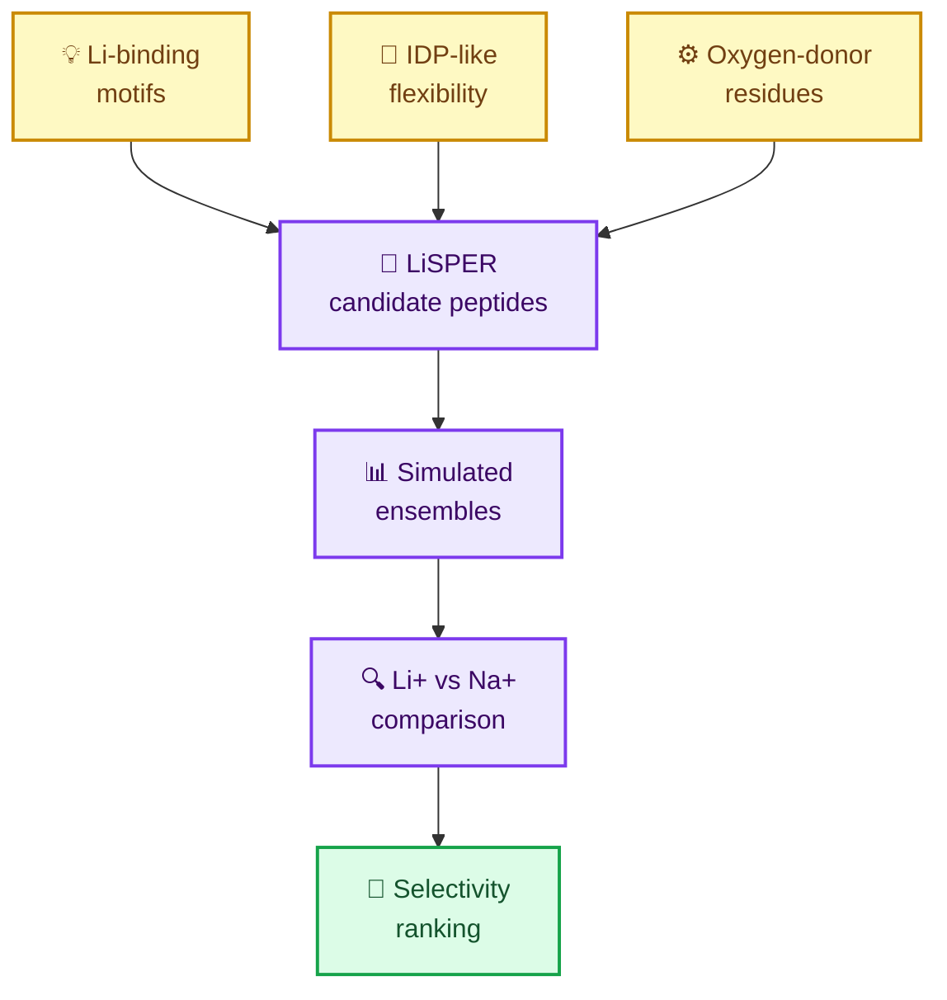
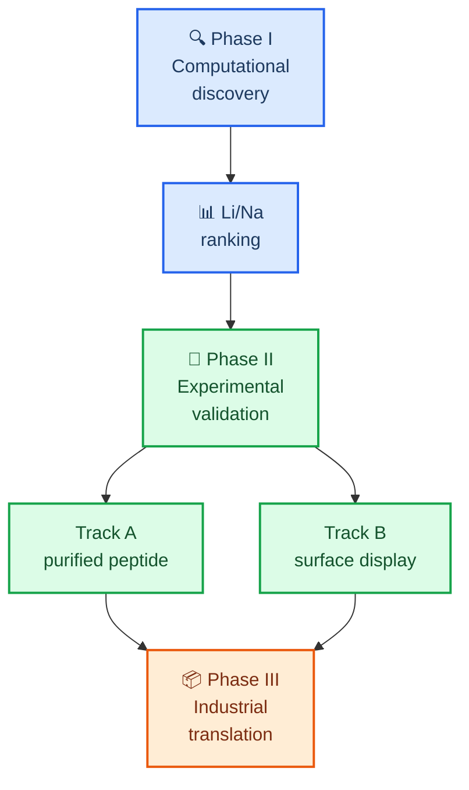
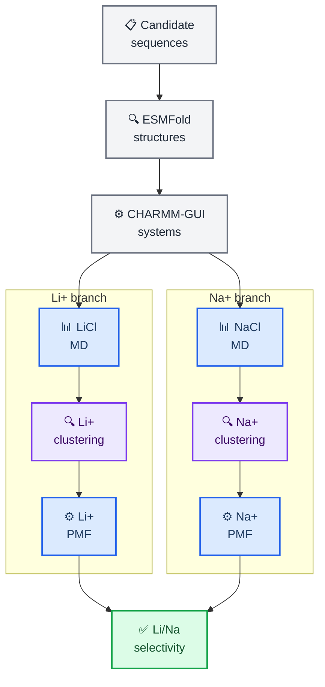
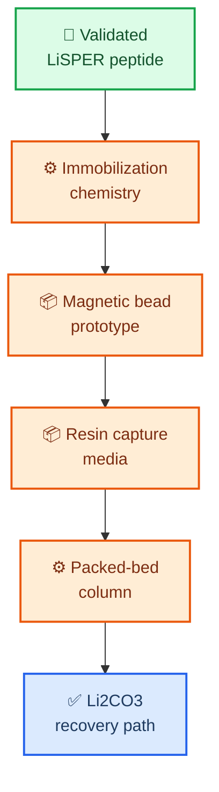
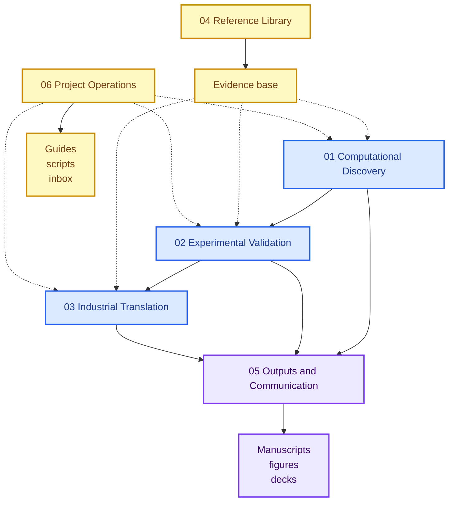

<p align="center">
  
</p>

<h1 align="center">LiSPER</h1>

<p align="center">
  <strong>Lithium-Selective Peptide Engineering and Recovery</strong><br>
  A computational-to-experimental program for designing lithium-selective peptides and translating them toward bio-inspired Direct Lithium Extraction (Bio-DLE).
</p>

<p align="center">
  
  
  
  
</p>

---

## 📋 Project overview

**LiSPER** is a scientific research and technology-development project for engineering short peptide systems that preferentially recognize lithium over sodium in aqueous environments.

The project combines **lithium-binding peptide inspiration**, **intrinsically disordered peptide principles**, and **computational protein engineering** to discover candidate Li+/Na+ selective peptide materials. The long-term aim is a deployable peptide-enabled lithium capture platform for battery recycling and Direct Lithium Extraction.

The repository now follows a clear program model:

- `01-03` are the active research pipeline.
- `04-06` are support layers for evidence, communication, and operations.
- `assets/` stores reusable branding and media.
- `archive/` preserves non-current material without presenting it as active work.

| What LiSPER is | Why it matters | Current focus |
|---|---|---|
| Lithium-selective peptide library | Li+/Na+ separation is central to lithium recovery | MD, clustering, PMF ranking |
| Computational discovery engine | Prioritizes candidates before wet-lab cost | LiCl vs NaCl free-energy comparison |
| Experimental validation program | Converts predictions into measurable assays | His6-SUMO peptide expression strategy |
| Bio-DLE translation roadmap | Connects molecular recognition to process design | Immobilized peptide capture concepts |

## 🎯 Scientific thesis

> **Flexible peptide motifs with oxygen-donor residues can form lithium coordination environments that differ measurably from sodium coordination under aqueous conditions.**

LiSPER does not only ask whether a peptide can bind Li+. It asks whether a peptide can prefer Li+ over Na+, and whether that preference can be carried from molecular simulation into experimental and eventually material formats.



## 🧭 Program roadmap

LiSPER is organized as a three-stage program: discover the molecular principle, validate it experimentally, then translate the best peptide systems into capture materials.



| Phase | Goal | Status | Near-term gate |
|---|---|---|---|
| **I. Computational discovery** | Rank LiSPER candidates by Li+/Na+ selectivity | Active | Finish production MD, clustering, umbrella sampling, PMF |
| **II. Experimental validation** | Test whether designed peptides show measurable selectivity | Preparing | Express purified-peptide constructs and prepare surface-display validation |
| **III. Industrial translation** | Convert validated peptides into capture media | Concept stage | Select immobilization and column prototype strategy |

## 📊 Project dashboard

| Workstream | Progress | Evidence in repository | Next decision |
|---|---:|---|---|
| **Candidate design** | `complete` | 10-peptide first-round library | Keep library stable through first PMF round |
| **ESMFold structures** | `complete` | Predicted PDB, PAE, plots | Use as starting structures only |
| **CHARMM-GUI systems** | `complete` | 10 LiCl and 10 NaCl systems | Preserve QC manifests |
| **GROMACS equilibration** | `complete` | LiCl and NaCl equilibration summaries | Continue production queue |
| **Production MD + clustering** | `active` | 20 ns LiCl/NaCl queues | Select representative structures |
| **Umbrella sampling + PMF** | `planned` | Workflow documented | Launch after clustering |
| **Wet-lab validation** | `preparing` | Purified-peptide and surface-display tracks | Begin expression/purification and plan eCPX constructs |
| **Bio-DLE translation** | `concept` | Deployment architecture notes | Prototype immobilized format |

```text
Computational discovery  [########--]  active
Wet-lab validation       [##--------]  preparing
Industrial translation   [#---------]  concept
```

## 🧪 Candidate library

The first-round LiSPER library is intentionally small: enough sequence diversity to test the design logic, but compact enough for simulation and wet-lab follow-through.

| Rank | Candidate | Sequence | Design role | First subset |
|---:|---|---|---|:---:|
| 1 | **LiD3-1** | `GPGDPGSGPGDPGSGPGDP` | Repeated GPGDP motif | Yes |
| 2 | **LiND-1** | `GPGNPGSGPGDPGSGPGNP` | Hybrid GPGNP/GPGDP motif | Yes |
| 3 | **IDP-Li-1** | `SGDSGPGDPGDSG` | Flexible acidic shell | Yes |
| 4 | **IDP-Li-2** | `GDSGSGPGDPGSGDS` | Symmetric disordered pocket | No |
| 5 | **LowCharge-Li** | `GPGDPGSGNPGSGDP` | Lower-charge risk control | Yes |
| 6 | **LiD2-IDP** | `GPGDPGSDGSGPGDP` | Dual motif with acidic spacer | No |
| 7 | **StrongBind-Li** | `GPGDPGSDGPGDPGSD` | Higher Asp-density binder | No |
| 8 | **SoftCage-Li** | `GSGDPGNGDPGSG` | Short oxygen-rich cage | No |
| 9 | **IDP-Rich-Li** | `DSGDSGPGDPGDSGS` | Highly disordered acidic design | No |
| 10 | **Control-Negative** | `GPGAPGSGPGAPGSGPGAP` | Weak/neutral control | Yes |

## ⚙️ Computational workflow

The computational pipeline is ensemble-aware because these peptides are short, flexible, and IDP-like. A single ESMFold structure is treated as a starting model, not as the final biological state.



<details>
<summary><strong>Why structural clustering is central</strong></summary>

LiSPER peptides are expected to sample many conformations during production MD. Structural clustering asks which conformations occur most often, then selects representative structures from populated states. This prevents umbrella sampling from starting from an arbitrary rare frame and makes the downstream PMF comparison more defensible.

</details>

---

## 🔬 Experimental validation

Phase II is designed to convert computational rankings into measurable biological evidence.

| Route | What it tests | Planned readout |
|---|---|---|
| **Track A: purified peptide** | Intrinsic LiSPER binding behavior | Li+ binding, Na+ competition, selectivity trend |
| **Track A: His6-SUMO fusion** | Expressible peptide production route | Soluble expression, purification, cleavage |
| **Track B: surface display** | LiSPER as biological capture interface | Whole-cell Li capture and Na competition |

The first experimental subset is `LiD3-1`, `LiND-1`, `IDP-Li-1`, `LowCharge-Li`, and `Control-Negative`.

## 🏭 Industrial outlook

The long-term deployment concept is an immobilized peptide capture process rather than a free peptide in solution.



**Vision:** LiSPER peptides -> Li+/Na+ selectivity -> experimental validation -> immobilized peptide systems -> peptide-enabled Direct Lithium Extraction.

## 📍 Repository navigation

The repository is organized as a research pipeline plus support layers. Folders `01-03` hold the active scientific program, while folders `04-06` hold references, communication outputs, and project operations.



| Directory | Purpose |
|---|---|
| [`01_computational_discovery/`](01_computational_discovery/) | Candidate sequences, ESMFold structures, CHARMM-GUI systems, MD, umbrella sampling, PMF, and analysis |
| [`02_experimental_validation/`](02_experimental_validation/) | Plasmids, wet-lab planning, purified-peptide validation, surface-display validation, and assay protocols |
| [`03_industrial_translation/`](03_industrial_translation/) | Immobilized capture formats, packed-bed process design, and deployment architecture |
| [`04_reference_library/`](04_reference_library/) | External evidence base: papers, patents, source metadata, citation exports, and reading notes |
| [`05_outputs_and_communication/`](05_outputs_and_communication/) | Manuscripts, figures, presentations, milestone summaries, and reviewer-facing materials |
| [`06_project_operations/`](06_project_operations/) | Repository guides, reusable scripts, decision records, and temporary intake inbox |
| [`assets/`](assets/) | Official LiSPER branding assets and reusable non-data media |
| [`archive/`](archive/) | Superseded designs and preserved legacy materials |

## 🔗 Key project documents

- [Repository guide](06_project_operations/docs/repository_guide.md)
- [Candidate design rationale](06_project_operations/docs/candidate_design_rationale.md)
- [MD to PMF workflow](06_project_operations/docs/md_to_pmf_workflow.md)
- [LiCl MD status](01_computational_discovery/md/li_cl/remote_runs/remote_status.md)
- [NaCl MD status](01_computational_discovery/md/na_cl/remote_runs/remote_status.md)
- [Surface-display host selection report](02_experimental_validation/track_B_surface_display/research/surface_display_host_selection/reports/final_host_selection_report.md)
- [Deployment architecture report](03_industrial_translation/deployment_architecture/reports/final_deployment_architecture_report.md)
- [Repository reorganization report](06_project_operations/docs/repository_reorganization_report.md)
- [README polish report](06_project_operations/docs/readme_polish_report_2026-06-15.md)
- [Branding assets](assets/branding/README.md)

## 📈 Research vision

LiSPER is meant to become more than a peptide list. It is a staged research program for discovering whether selective ion recognition can be engineered into compact, experimentally tractable peptide materials.

If successful, the platform could support:

- selective Li+/Na+ separation in battery-recycling streams
- peptide-based polishing after upstream transition-metal removal
- immobilized Bio-DLE media for lithium-bearing aqueous streams
- broader design principles for peptide-enabled ion separations

---

<p align="center">
  <strong>LiSPER asks a simple hard question:</strong><br>
  Can engineered peptide ensembles make lithium recovery more selective, biological, and modular?
</p>
