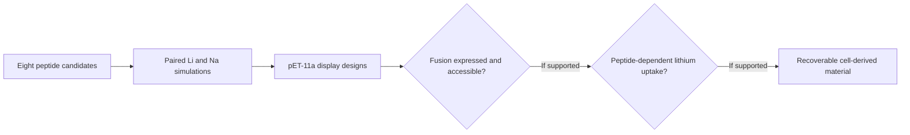

  

# LiSPER

**Lithium-Selective Peptide Engineering and Recovery** is Yukun Lin's Signature Work on peptide-based lithium recovery, supervised by Ferdinand Kappes at Duke Kunshan University. The project began with computational design and is moving toward experimental validation. Its long-term motivation is lithium recovery from battery-recycling and other mixed-ion streams.

The project moves through three evidence gates. The first two stages below are complete as designs and calculations; the biological and material tests are planned.

## Where the project stands

| Stage | Current evidence | Next decision |
| --- | --- | --- |
| Computational discovery | Eight peptides have paired LiCl/NaCl simulations and completed umbrella/PMF analysis. | Test whether predicted preferences appear in measured ion uptake. |
| Surface-display design | The final [pET-11a design package](02_experimental_validation/plasmids/pET-11a/README.md) contains four peptide fusions, three scaffold controls, and the reference backbone. The project lead has submitted the designs to the vendor. | Verify fusion expression and accessible display after the constructs arrive. |
| Lithium capture | No experimental Li⁺ uptake or Li⁺/Na⁺ selectivity result yet. | Compare candidate cells with matched controls in Li-only, Na-only, and mixed-ion solutions. |
| Recoverable material | Concept stage. | If capture is confirmed, test whether inactivated, immobilized cell material retains performance and can be separated. |

The computational result is a **within-protocol comparison**, not a measured adsorption capacity. The reported quantity is `ΔΔG = ΔG(Li⁺) − ΔG(Na⁺)`; negative values indicate nominal Li⁺ preference. Estimates are radially corrected and endpoint-referenced, **not 1 M standard-state binding free energies**. Bootstrap SD and sampling diagnostics remain part of the result. See the [validated table](01_computational_discovery/pmf/selectivity_summary.tsv), [PMF notes](01_computational_discovery/pmf/README.md), and [source-validation script](06_project_operations/scripts/analyze_selectivity.py). LiDA-1 has the most negative nominal estimate in this set; this does not establish experimental selectivity.

## What happens next

1. Confirm the pET-11a/eCPX fusion is expressed. Immunoblotting and gel analysis can support expression of the fusion, while intact-cell anti-His staining and a surface-protease comparison can test tag accessibility. Neither result alone proves that the candidate peptide binds lithium.
2. Measure Li⁺ and Na⁺ before and after contact with cells, using no-cell, host, vector, scaffold, and tag-placement controls. Compare a bacterial-dose range and test Li-only, Na-only, and mixed-ion solutions.
3. If peptide-dependent uptake is reproducible, assess a contained, recoverable format made from inactivated display cells. Peptide-coated magnetic beads are a comparison, not the assumed product.

These are planned experiments. The [experimental overview](02_experimental_validation/README.md) records the decision points; laboratory conditions and analytical methods will be finalized with the host laboratory.

## Repository map

| Folder | Contents |
| --- | --- |
| [Computational discovery](01_computational_discovery/) | Sequences, structures, MD, umbrella sampling, PMF evidence, and analysis |
| [Experimental validation](02_experimental_validation/) | Final plasmid designs and planned expression, display, and ion-uptake checks |
| [Industrial translation](03_industrial_translation/) | Recoverable-material concept and process questions |
| [Reference library](04_reference_library/) | Literature and source notes |
| [Outputs and communication](05_outputs_and_communication/) | Figures, manuscript planning, presentations, and milestones |
| [Project operations](06_project_operations/) | Guides, scripts, and intake files |
| [Branding](assets/branding/) | Logos and banners |

Raw simulation data and archived inputs remain in their source folders. Proposal and application files are maintained outside this repository.
