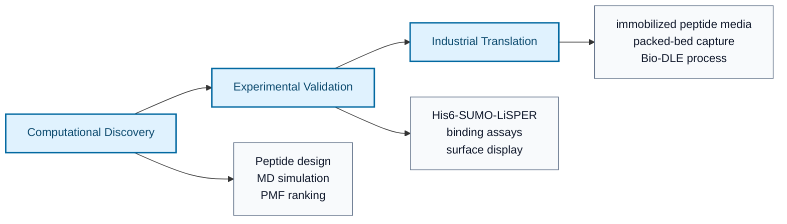
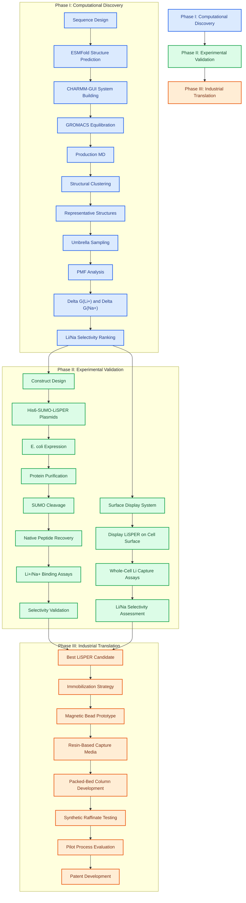
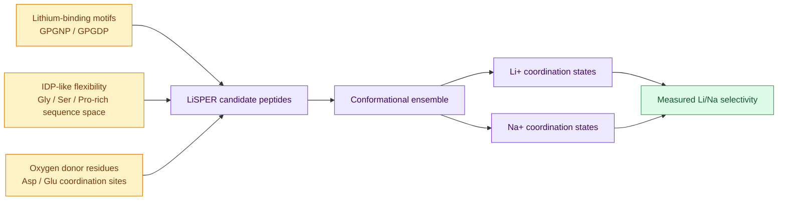
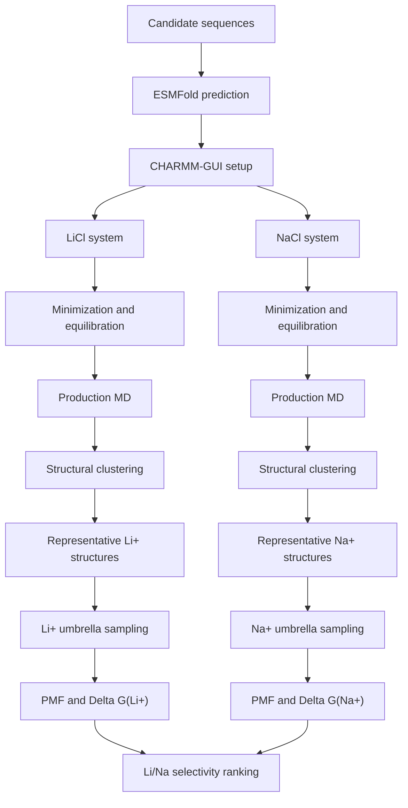
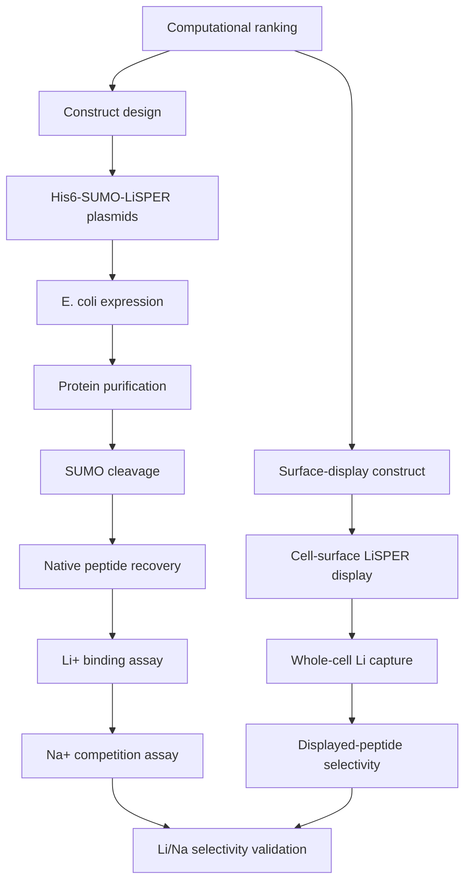
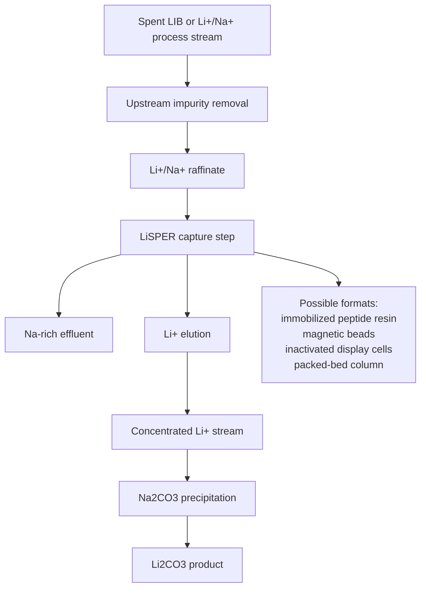
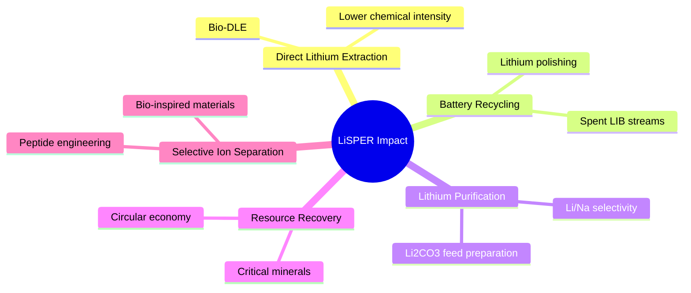

# LiSPER

## Lithium-Selective Peptide Engineering and Recovery

**Engineering selective lithium-recognition peptides through computational design, experimental validation, and industrial translation.**

LiSPER is a research and technology-development program for designing **de novo lithium-selective peptides** and translating them into a future protein-based Direct Lithium Extraction platform.



---

## Project Vision

Current lithium recovery technologies face persistent challenges in **selectivity, cost, energy use, chemical intensity, and sustainability**, especially when Li+ must be separated from chemically similar or highly abundant ions such as Na+.

LiSPER aims to develop short lithium-recognition peptides inspired by:

| Inspiration | Role in LiSPER |
|---|---|
| Lithium-binding peptide motifs | Provide motif-level precedent for Li+-associated peptide behavior. |
| Intrinsically disordered peptide principles | Enable flexible conformational sampling and adaptive ion coordination. |
| Computational protein engineering | Enables rapid design, simulation, ranking, and experimental prioritization. |

The ultimate goal is a **protein-based Direct Lithium Extraction platform**, or **Bio-DLE**, in which engineered LiSPER peptides selectively capture lithium from battery-recycling or lithium-processing streams and feed conventional lithium carbonate production.

---

## Project Roadmap



### Phase I: Computational Discovery

**Goal:** identify the most promising LiSPER candidates computationally.

**Current status:** active.

Phase I uses ensemble-aware molecular simulation to avoid overinterpreting a single folded model. The intended comparison is:

`Delta Delta G = Delta G(Li+) - Delta G(Na+)`

More negative values indicate stronger predicted lithium preference.

### Phase II: Experimental Validation

**Goal:** experimentally validate computational predictions.

**Expected outcome:** publication-quality biological evidence showing whether designed LiSPER peptides exhibit measurable Li+/Na+ selectivity.

Phase II includes two complementary validation routes:

1. **Purified peptide route:** His6-SUMO-LiSPER expression, purification, SUMO cleavage, native peptide recovery, and binding assays.
2. **Surface-display route:** cellular display of LiSPER peptides followed by whole-cell capture and selectivity assays.

### Phase III: Industrial Translation

**Goal:** transform LiSPER from a peptide into a deployable lithium-capture technology.

Phase III evaluates immobilized peptides, magnetic bead prototypes, resin capture media, packed-bed columns, synthetic raffinate testing, and patentable process architecture.

---

## Scientific Hypothesis

> **Hybridization of lithium-binding motifs and intrinsically disordered peptide properties can generate peptides with measurable lithium selectivity over sodium in aqueous solution.**



The goal is not simply strong Li+ binding. The goal is **selective Li+ recognition over Na+** under aqueous conditions relevant to lithium recovery.

---

## Current Candidate Library

| Candidate | Sequence family | Status | MD complete? | Umbrella sampling complete? | Wet-lab complete? |
|---|---|---|---:|---:|---:|
| LiD3-1 | Repeated GPGDP motif | Primary computational and wet-lab candidate | In progress | No | No |
| LiND-1 | Mixed GPGNP/GPGDP motif | Primary computational and wet-lab candidate | In progress | No | No |
| IDP-Li-1 | IDP-like acidic shell | Primary computational and wet-lab candidate | In progress | No | No |
| IDP-Li-2 | Symmetric disordered pocket | Screening candidate | In progress | No | No |
| LiD2-IDP | Dual GPGDP with acidic spacer | Screening candidate | In progress | No | No |
| StrongBind-Li | Higher Asp-density design | Screening candidate | In progress | No | No |
| SoftCage-Li | Short oxygen-rich flexible cage | Screening candidate | In progress | No | No |
| IDP-Rich-Li | Strongly disordered acidic design | Screening candidate | In progress | No | No |
| LowCharge-Li | Reduced-charge motif design | Primary computational and wet-lab candidate | In progress | No | No |
| Control-Negative | Neutral motif-related control | Negative control | In progress | No | No |

Recommended starting wet-lab subset:

`LiD3-1`, `LiND-1`, `IDP-Li-1`, `LowCharge-Li`, `Control-Negative`

---

## Computational Workflow



Why clustering matters: LiSPER peptides are flexible and IDP-like. A random trajectory frame may represent a rare state. Clustering identifies populated conformational families, making umbrella sampling and PMF comparison more meaningful.

### Simulation Choices

| Decision | Current value | Rationale |
|---|---|---|
| Force field | CHARMM36m | Compatible with peptide and IDP-oriented CHARMM workflows. |
| Water model | TIP3P | Standard CHARMM-GUI setup for these systems. |
| Ion systems | Separate LiCl and NaCl systems | Enables clean Li+ vs Na+ free-energy comparison. |
| First production length | 20 ns | Provides an initial ensemble for clustering and representative-state selection. |
| Mixed-ion systems | Later validation round | Reserved for competition assays after single-ion behavior is understood. |

---

## Experimental Validation Strategy



The purified-peptide track tests the intrinsic binding behavior of LiSPER candidates. The surface-display track tests whether LiSPER can function as a biological capture interface.

---

## Industrial Translation Concept



Current literature assessments in this repository favor **purified immobilized LiSPER peptide in a packed-bed adsorption column** as the most realistic industrial endpoint, with inactivated surface-display biomass and magnetic bead systems as useful bridge technologies.

---

## Repository Structure

```text
LiSPER/
├── analysis/          # Analysis notebooks, scripts, and derived interpretation
├── charmm-gui/        # CHARMM-GUI system-builder outputs for LiCl and NaCl systems
├── data/              # Raw and processed data
├── docs/              # Design rationale and workflow documentation
├── esmfold/           # Structure prediction inputs, outputs, PAE, plots, and PDBs
├── figures/           # Figures for reports, manuscripts, and presentations
├── literature/        # Literature reviews and technology assessments
├── manuscript/        # Publication drafts and manuscript assets
├── md/                # GROMACS equilibration, production, logs, and clustering work
├── plasmids/          # His6-SUMO-LiSPER plasmid design and vendor-ready records
├── pmf/               # Potential of mean force analysis outputs
├── protocols/         # Experimental and computational protocols
├── scripts/           # Utility scripts for design, setup, and analysis
├── sequences/         # Candidate peptide sequences and metadata
├── umbrella/          # Umbrella sampling setup and windows
└── wetlab/            # Expression, purification, assay, and validation planning
```

| Folder | Purpose |
|---|---|
| `analysis/` | Downstream analysis, summary calculations, and interpretation. |
| `charmm-gui/` | System-builder outputs for solvated LiCl and NaCl peptide simulations. |
| `esmfold/` | Structure prediction pipeline outputs and CHARMM-GUI-ready PDBs. |
| `md/` | GROMACS simulation scripts, remote run logs, equilibration, production, and clustering. |
| `umbrella/` | Umbrella sampling setups for ion-peptide separation coordinates. |
| `pmf/` | PMF analysis and Delta G comparison for Li+ and Na+. |
| `plasmids/` | His6-SUMO-LiSPER plasmid designs, vector maps, and vendor-ready files. |
| `wetlab/` | Experimental planning for expression, purification, cleavage, and binding assays. |
| `literature/` | Literature-driven assessments for protein design, host selection, and deployment architecture. |
| `protocols/` | Reproducible protocols for computational and experimental workflows. |
| `manuscript/` | Manuscript drafts, figures, and publication planning. |

---

## Current Status

```text
Computational Discovery:  ████████░░ 80%
Experimental Validation:  ██░░░░░░░░ 20%
Industrial Translation:   ░░░░░░░░░░ 0%
```

| Program area | Status | Near-term gate |
|---|---|---|
| Computational Discovery | Active | Complete clustering, representative structure selection, umbrella sampling, and PMF ranking. |
| Experimental Validation | In preparation | Express and purify His6-SUMO-LiSPER candidates; establish Li+/Na+ binding assays. |
| Industrial Translation | Literature and concept stage | Convert validated peptides into immobilized capture formats and column concepts. |

---

## Key Documents

- [Repository guide](docs/repository_guide.md)
- [Candidate design rationale](docs/candidate_design_rationale.md)
- [MD to PMF workflow](docs/md_to_pmf_workflow.md)
- [LiCl MD status](md/li_cl/remote_runs/remote_status.md)
- [NaCl MD status](md/na_cl/remote_runs/remote_status.md)
- [Surface-display host selection report](literature/surface_display_host_selection/reports/final_host_selection_report.md)
- [Deployment architecture report](literature/deployment_architecture/reports/final_deployment_architecture_report.md)

---

## Long-Term Impact

LiSPER is designed as a platform technology for selective ion recognition and sustainable resource recovery.

Potential applications include:

- **Direct Lithium Extraction (DLE):** selective lithium capture from complex aqueous streams.
- **Battery Recycling:** late-stage lithium polishing after transition-metal removal.
- **Lithium Purification:** improved Li+/Na+ separation before lithium carbonate production.
- **Resource Recovery:** bio-inspired recovery of critical minerals from waste streams.
- **Selective Ion Separation:** generalizable peptide-engineering principles for difficult ion separations.



---

## Team

### LiSPER Team

**Lithium-Selective Peptide Engineering and Recovery**

**Mission:** designing the next generation of bio-inspired lithium capture technologies.

LiSPER is built for collaboration across computational protein design, molecular simulation, biochemistry, synthetic biology, hydrometallurgy, and technology translation. The repository is intended to support researchers, student team members, faculty advisors, DKU Innovation & Entrepreneurship reviewers, potential investors, and future collaborators.

---

## Working Principle

For LiSPER, the scientifically careful path is:

`ESMFold -> CHARMM-GUI -> equilibration -> production MD -> clustering -> representative structures -> umbrella sampling -> PMF -> selectivity`

The project should avoid the shortcut:

`ESMFold -> umbrella sampling`

because flexible peptides require ensemble-aware structure selection before free-energy calculations.
