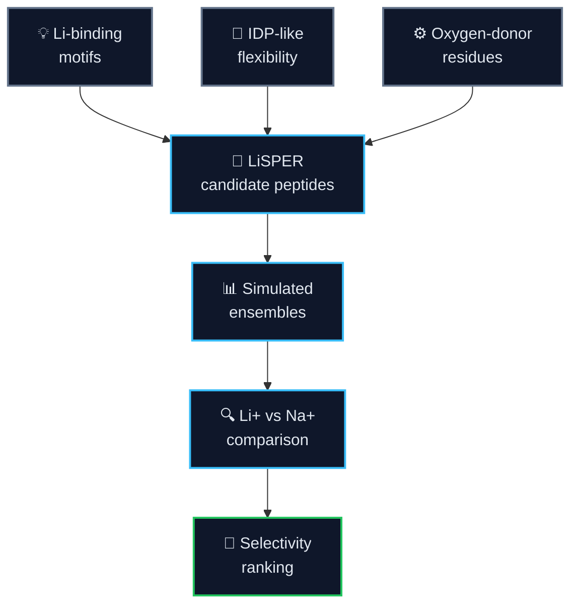
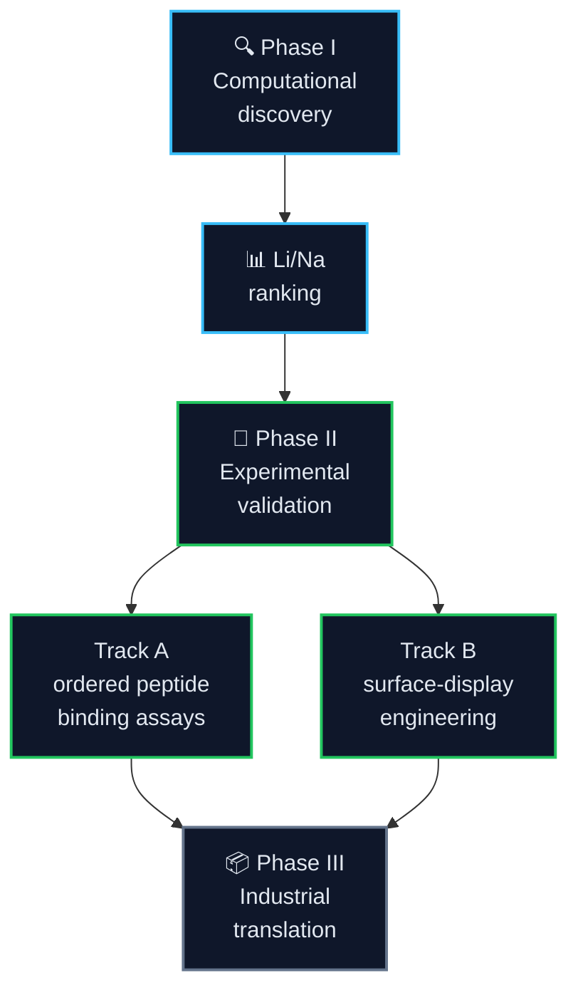
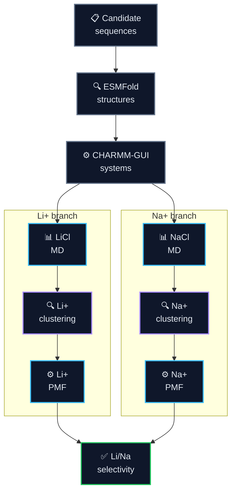
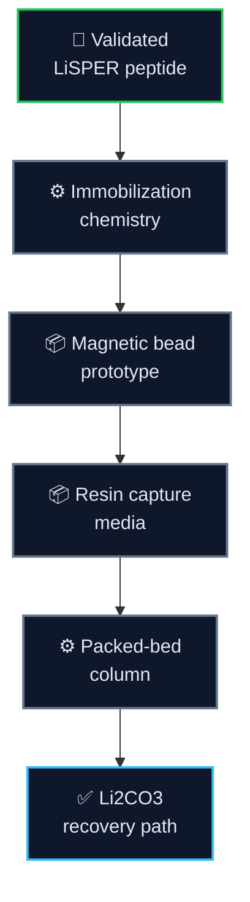
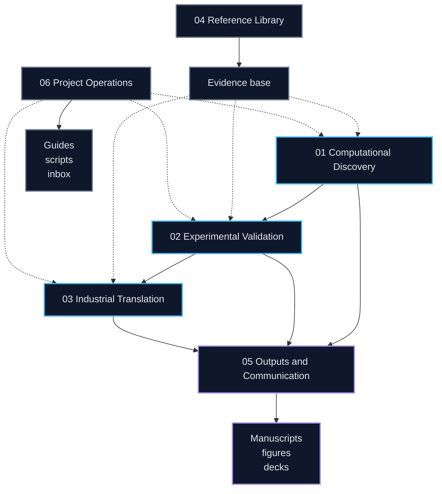

  

<h1 align="center">LiSPER</h1>

  <strong>Lithium-Selective Peptide Engineering and Recovery</strong> 
  A computational-to-experimental program for designing lithium-selective peptides and translating them toward bio-inspired Direct Lithium Extraction (Bio-DLE).

  
  
  
  
  

---

## 📋 Project overview

**LiSPER** is a scientific research and technology-development project for engineering short peptide systems that preferentially recognize lithium over sodium in aqueous environments.

The project combines **lithium-binding peptide inspiration**, **intrinsically disordered peptide principles**, and **computational protein engineering** to discover candidate Li+/Na+ selective peptide materials. The long-term aim is a deployable peptide-enabled lithium capture platform for battery recycling and Direct Lithium Extraction.

The repository now follows a clear program model:

- `01-03` are the active research pipeline.
- `04-06` are support layers for evidence, communication, and operations.
- `assets/` stores reusable branding and media.
- `archive/` preserves non-current material without presenting it as active work.

| What LiSPER is | Why it matters | Current focus |
|---|---|---|
| Lithium-selective peptide library | Li+/Na+ separation is central to lithium recovery | Final 8-candidate intake |
| Computational discovery engine | Prioritizes candidates before wet-lab cost | Full LiCl/NaCl MD setup gate |
| Experimental validation program | Converts predictions into measurable assays | Ordered synthetic peptide binding first, then surface display |
| Bio-DLE translation roadmap | Connects molecular recognition to process design | Immobilized peptide capture concepts |

## 🎯 Scientific thesis

> **Flexible peptide motifs with oxygen-donor residues can form lithium coordination environments that differ measurably from sodium coordination under aqueous conditions.**

LiSPER does not only ask whether a peptide can bind Li+. It asks whether a peptide can prefer Li+ over Na+, and whether that preference can be carried from molecular simulation into experimental and eventually material formats.

## 🧭 Program roadmap

LiSPER is organized as a three-stage program: discover the molecular principle, validate it experimentally, then translate the best peptide systems into capture materials.

| Phase | Goal | Status | Near-term gate |
|---|---|---|---|
| **I. Computational discovery** | Rank LiSPER candidates by Li+/Na+ selectivity | Active | Finish production MD, clustering, umbrella sampling, PMF |
| **II. Experimental validation** | Test whether designed peptides show measurable selectivity | Preparing | Order synthetic peptides, run Li/Na binding assays, then build surface-display constructs |
| **III. Industrial translation** | Convert validated peptides into capture media | Concept stage | Select immobilization and column prototype strategy |

## 📊 Progress monitor dashboard

> [!IMPORTANT]
> **Live MD control panel.** The pre-MD intake gates are closed: final library, ESMFold structures, and paired LiCl/NaCl CHARMM-GUI systems are complete. The active remote workload has been migrated onto the 32-core GCP runner, with AutoDL retained only as a backup/source while final handoff is verified. LiCl production/clustering is complete for all eight candidates; NaCl has seven representatives ready and one backfill production still running. Refined umbrella tracks are active for `LiDA-1`, `LiDS-1`, `LiD3-Flex`, `LiD3-Core`, `LiLC-1`, `LiA3-Ref`, and `LiN3-Core`.
>
> 
> 
> 
> 
> 
> 

  <a href="https://jackyissocute.github.io/LiSPER-Dashboard/"><strong>Open LiSPER Dashboard</strong></a>

**Last synchronized monitor snapshot:** `2026-07-02 06:49 CST`

**GCP migration checkpoint:** the 32-core GCP runner is carrying the active production, umbrella, and PMF/QC workload. A shutdown-safety archive of recent AutoDL checkpoints/logs was copied to the GCP data disk at `2026-06-30 13:11 CST` before any AutoDL shutdown decision.

**Worker A storage cleanup:** at `2026-06-28 19:05 CST`, the inactive 10-candidate legacy archive was filtered into a local safety snapshot, then removed remotely. Worker A recovered from `96%` used (`1.4 GB` free) to `80%` used (`6.1 GB` free). The local safety snapshot is ignored by Git because it is `1.4 GB`; current status, refined umbrella products, and cleanup metadata remain versioned.

**Status color rule:** status colors are global and independent of ion identity: complete = green `#22C55E`, running = cyan `#38BDF8`, queued = yellow `#FACC15`, QC review = purple `#A78BFA`, warning/repair/failed = coral/red `#FB7185`/`#EF4444`, planned = slate `#64748B`. LiCl and NaCl use identity accents only: LiCl `#818CF8`, NaCl `#2DD4BF`.

**Umbrella stage rule:** umbrella progress is reported as five fixed sub-steps: `Prep -> Pull -> Windows generated -> Umbrella MD -> QC`. Stage position says what step it is; status text/color says the state of that step.

### Process matrix

<table>
  <thead>
    <tr>
      <th>Track</th>
      <th>Process</th>
      <th>Progress</th>
      <th>Status</th>
    </tr>
  </thead>
  <tbody>
    <tr>
      <td><strong>Compute</strong></td>
      <td>Worker load</td>
      <td><code>25/32 GCP mdrun threads running</code> GCP runner carries active umbrella, one remaining production tail, and LiDA-1 LiCl V4 tail repair; AutoDL is backup/source only.</td>
      <td></td>
    </tr>
    <tr>
      <td rowspan="2"><strong>LiCl</strong></td>
      <td>20 ns production MD</td>
      <td><code>8/8 complete</code> Last completions: <code>LiD3-Flex</code>, <code>LiND-Hybrid</code></td>
      <td></td>
    </tr>
    <tr>
      <td>Structural clustering</td>
      <td><code>8/8 reps complete</code></td>
      <td></td>
    </tr>
    <tr>
      <td rowspan="2"><strong>NaCl</strong></td>
      <td>20 ns production MD</td>
      <td><code>7/8 complete</code> <code>LiN3-Core</code> produced/clustered; <code>LiND-Hybrid</code> backfill remains active</td>
      <td></td>
    </tr>
    <tr>
      <td>Structural clustering</td>
      <td><code>7/8 reps complete; 1 planned after production</code></td>
      <td></td>
    </tr>
    <tr>
      <td rowspan="2"><strong>Free energy</strong></td>
      <td>Umbrella windows</td>
      <td><strong>Refined umbrella tracks running</strong> LiDA/LiDS/LiD3-Flex windows, LiD3-Core/LiLC-1, LiA3-Ref, and LiN3-Core NaCl windows</td>
      <td></td>
    </tr>
    <tr>
      <td>WHAM / PMF / ΔG</td>
      <td><code>LiDA-1 paired WHAM under repair/QC: NaCl V4 numeric screen pass; LiCl V2 WHAM triggered V3 tail repair</code></td>
      <td></td>
    </tr>
  </tbody>
</table>

### Protein-focused matrix

LiCl and NaCl setup are complete for all eight candidates, so this live matrix now focuses on active and upcoming production/free-energy gates.

<table>
  <thead>
    <tr>
      <th>Protein</th>
      <th>LiCl production / representative</th>
      <th>NaCl production / representative</th>
      <th>Umbrella sampling</th>
      <th>WHAM / PMF / ΔG</th>
    </tr>
  </thead>
  <tbody>
    <tr>
      <td><strong>LiD3-Core</strong></td>
      <td> representative ready, top cluster <code>12.69%</code></td>
      <td> representative ready, top cluster <code>10.34%</code></td>
      <td><code>LiCl V2 2/27</code>: Prep complete; Pull complete; 27 windows generated; Umbrella MD running <code>002-003</code>; QC planned <code>NaCl V2 2/27</code>: Prep complete; Pull complete; 27 windows generated; Umbrella MD running <code>002-003</code>; QC planned</td>
      <td> pending refined windows</td>
    </tr>
    <tr>
      <td><strong>LiD3-Flex</strong></td>
      <td> representative ready, top cluster <code>4.40%</code></td>
      <td> representative ready, top cluster <code>3.80%</code></td>
      <td><code>LiCl V2 4/27</code>: Prep complete; Pull complete; 27 windows generated; Umbrella MD running <code>004-007,020-024</code>; QC planned <code>NaCl V2 5/27</code>: Prep complete; Pull complete; 27 windows generated; Umbrella MD running <code>002,005,007-009</code>; QC planned</td>
      <td> pending refined WHAM/time-slice checks</td>
    </tr>
    <tr>
      <td><strong>LiND-Hybrid</strong></td>
      <td> representative ready, top cluster <code>12.89%</code></td>
      <td> GCP backfill active</td>
      <td> after NaCl representative</td>
      <td> after umbrella sampling</td>
    </tr>
    <tr>
      <td><strong>LiLC-1</strong></td>
      <td> representative ready, top cluster <code>4.15%</code></td>
      <td> representative ready, top cluster <code>1.95%</code></td>
      <td><code>LiCl 3/21</code>: Prep complete; Pull complete; 21 windows generated; Umbrella MD queued at <code>003</code>; QC planned <code>NaCl V2 2/27</code>: Prep complete; Pull complete; 27 windows generated; Umbrella MD running <code>002-003</code>; QC planned</td>
      <td> after umbrella sampling</td>
    </tr>
    <tr>
      <td><strong>LiDS-1</strong></td>
      <td> representative ready, top cluster <code>15.69%</code></td>
      <td> representative ready, top cluster <code>14.59%</code></td>
      <td><code>LiCl V2 24/27</code>: Prep complete; Pull complete; 27 windows generated; Umbrella MD running <code>024-026</code>; QC planned <code>NaCl V2 27/27</code>: Prep complete; Pull complete; 27 windows generated; Umbrella MD complete; QC review needed</td>
      <td> NaCl V2 WHAM complete: <code>0</code> nonfinite points, <code>2</code> poor-sampling warnings</td>
    </tr>
    <tr>
      <td><strong>LiDA-1</strong></td>
      <td> representative ready, top cluster <code>17.64%</code></td>
      <td> representative ready, top cluster <code>17.94%</code></td>
      <td><code>LiCl V4 27/27</code>: Prep complete; Pull complete; 27 windows generated; Umbrella MD repair running at <code>026</code>; QC warning <code>NaCl V4 25/25</code>: Prep complete; Pull complete; 25 WHAM input windows complete; Umbrella MD complete; QC review needed</td>
      <td> NaCl V4 safe-boundary diagnostic has <code>200/200</code> finite points, <code>0</code> scientific warnings, and <code>0.56 kJ/mol</code> time-slice span shift. LiCl V3 WHAM has <code>200/200</code> finite points but <code>11</code> poor-sampling warning lines and <code>2.71 kJ/mol</code> burn-in/time-slice span shift, so LiCl V4 tail repair is running before Delta G promotion.</td>
    </tr>
    <tr>
      <td><strong>LiN3-Core</strong></td>
      <td> representative ready, top cluster <code>4.65%</code></td>
      <td> representative ready, top cluster <code>11.44%</code></td>
      <td><code>LiCl 3/21</code>: Prep complete; Pull complete; 21 windows generated; Umbrella MD queued at <code>003</code>; QC planned <code>NaCl V2 0/27</code>: Prep complete; Pull complete; 27 windows generated; Umbrella MD running <code>000-001</code>; QC planned</td>
      <td> pending refined windows</td>
    </tr>
    <tr>
      <td><strong>LiA3-Ref</strong></td>
      <td> representative ready, top cluster <code>5.05%</code></td>
      <td> representative ready, top cluster <code>7.35%</code></td>
      <td><code>LiCl 2/21</code>: Prep complete; Pull complete; 21 windows generated; Umbrella MD queued at <code>002</code>; QC planned <code>NaCl V2 2/27</code>: Prep complete; Pull complete; 27 windows generated; Umbrella MD running <code>002-003</code>; QC planned</td>
      <td> after umbrella sampling</td>
    </tr>
  </tbody>
</table>

### Remaining-time horizon

<table>
  <thead>
    <tr>
      <th>Gate</th>
      <th>Time remaining</th>
      <th>What clears the gate</th>
    </tr>
  </thead>
  <tbody>
    <tr>
      <td><strong>Setup QC completion</strong></td>
      <td align="center"><strong><code>Complete</code></strong> LiCl and NaCl setup gate is closed</td>
      <td>Setup gate is closed; continue production/clustering QC.</td>
    </tr>
    <tr>
      <td><strong>20 ns production + clustering</strong></td>
      <td align="center"><strong><code>~5-8 days</code></strong> one NaCl production tail remains at ~15.98/20 ns</td>
      <td>Finish the remaining production log, cluster the trajectory, and extract the dominant representative structure.</td>
    </tr>
    <tr>
      <td><strong>Umbrella sampling</strong></td>
      <td align="center"><strong><code>~1-4 days first paired QC; ~2-5 days broader table</code></strong> LiDA-1 LiCl V3 repair completed but did not pass QC; V4 window 026 repair is running. LiDS-1 has 24/27 LiCl windows complete; LiD3-Flex has 4/27 LiCl and 5/27 NaCl windows complete, with guarded LiCl backfill windows active.</td>
      <td>Finish active repair/window production, then rerun WHAM/bootstrap/time-slice QC.</td>
    </tr>
    <tr>
      <td><strong>WHAM / PMF / ΔG extraction</strong></td>
      <td align="center"><strong><code>~1-4 days after paired windows</code></strong> WHAM/bootstrap/time-slice QC, plus targeted repairs if overlap is weak</td>
      <td>Run WHAM/PMF analysis, inspect convergence, then extract ΔG for paired Li+/Na+ systems.</td>
    </tr>
    <tr>
      <td><strong>First ΔΔG selectivity table</strong></td>
      <td align="center"><strong><code>~1-4 days, repair-risk limited</code></strong> LiDA-1 NaCl V4 analysis completed; LiDA-1 LiCl V3 combined WHAM still failed numeric QC, so a one-window V4 tail extension is running before paired region review</td>
      <td>Complete paired PMFs, then compute ΔΔG = ΔG(Na+) - ΔG(Li+) and rank candidates.</td>
    </tr>
  </tbody>
</table>

> Time estimates are based on the current GCP `24` real `mdrun` jobs using `25` OpenMP threads, the active LiDA-1 LiCl V4 one-window tail repair, and the observed remaining `LiND-Hybrid` NaCl production tail at `15.98/20 ns`. The first likely paired Delta Delta G table remains LiDA-1, but LiCl V3 WHAM did not pass the reliability gate and is being repaired before any Delta G promotion.

<strong>Current MD interpretation</strong>

- LiCl minimization and equilibration are complete for all eight candidates.
- NaCl setup is complete for all eight candidates.
- LiCl and NaCl 20 ns production/clustering are now being carried by the 32-core GCP runner, with AutoDL retained as a backup/source during final handoff.
- GCP is active with `24` real `mdrun` processes using `25` OpenMP threads after the LiDA-1 LiCl V4 repair launch. Recent AutoDL checkpoint/log evidence was archived on the GCP data disk before shutdown planning, so the handoff does not depend on live AutoDL state.
- LiCl representatives are ready for `LiDA-1`, `LiDS-1`, `LiD3-Core`, `LiLC-1`, `LiN3-Core`, and `LiA3-Ref`; NaCl representatives are ready for `LiDA-1`, `LiDS-1`, `LiLC-1`, `LiA3-Ref`, `LiD3-Core`, and `LiN3-Core`.
- Umbrella sampling is condition-specific: refined tracks are active for `LiDA-1`, `LiDS-1`, `LiD3-Flex`, `LiD3-Core`, `LiLC-1`, `LiA3-Ref`, and `LiN3-Core` where representative inputs are ready. The refined tracks use the dominant-cluster representative frame, a donor/binding-site-to-ion reaction coordinate, explicit window equilibration, denser spacing, and longer window sampling.
- NaCl `LiDA-1` V4 WHAM completed from `25` input windows. The full-range profile remains preliminary because far-tail sampling warnings persist outside the PBC-safe material region, but the PBC-safe boundary diagnostic (`1.03-2.90 nm`) has `200/200` finite profile points, `0` scientific WHAM warnings, and a `0.56 kJ/mol` time-slice span shift. LiCl `LiDA-1` V3 combined WHAM completed from `27` windows with `200/200` finite points, but retained `11` poor-sampling warning lines at `z=2.23271-2.25490 nm` and a `2.71 kJ/mol` burn-in/time-slice span shift. Clipped V3 diagnostics still retained warnings and `2.74-2.82 kJ/mol` span shift, so a V4 extension of window `026` is running. NaCl `LiDS-1` V2 WHAM completed from 27 refined windows with `200/200` finite profile points and two poor-sampling warning hits, and remains preliminary until QC review.
- All eight LiCl and all eight NaCl CHARMM-GUI systems are GROMACS-ready.
- Active MD should continue only from final 8-candidate names and matched LiCl/NaCl systems.

## 🧪 Candidate library

The active LiSPER library contains 8 candidates selected from the updated LBP, IDP, and Li+ coordination design logic. Paired LiCl/NaCl systems are prepared for all eight candidates; the leading tracks are now in refined umbrella sampling while one NaCl production tail continues.

| Rank | Candidate | Sequence | Design role | Current MD status |
|---:|---|---|---|---|
| 1 | **LiD3-Core** | `GPGDPGPGDPGPGDP` | Linker-free GPGDP trimer benchmark | Refined LiCl/NaCl V2 windows `2/27` complete with `002-003` active on both conditions |
| 2 | **LiD3-Flex** | `GPGDPGSGPGDPGSGPGDP` | Flexible GSG-spaced GPGDP trimer | Refined LiCl `4/27` and NaCl `5/27` umbrella windows complete; LiCl backfill windows active; PMF QC pending final refined run |
| 3 | **LiND-Hybrid** | `GPGNPGSGPGDPGSGPGNP` | Mixed GPGNP/GPGDP donor environment | LiCl representative ready; NaCl GCP backfill active at `15.98/20 ns` |
| 4 | **LiLC-1** | `GPGDPGSGNPGSGDP` | Lower-charge selectivity-control design | LiCl `3/21`, next window ready; NaCl `V2 2/27`, active `002-003` |
| 5 | **LiDS-1** | `DGDGPGDPGDG` | Asp/Gly Li+/Na+ geometry probe | LiCl refined windows active; NaCl V2 WHAM complete but preliminary pending QC review |
| 6 | **LiDA-1** | `DADGPGDPDAG` | Ala-supported Asp pocket probe | LiCl `V3 27/27`, V3 WHAM failed numeric QC and V4 window `026` repair is active; NaCl V4 safe-boundary PMF diagnostic numeric-screen pass, manual region review required |
| 7 | **LiN3-Core** | `GPGNPGPGNPGNP` | GPGNP trimer benchmark | NaCl representative ready; NaCl `V2 0/27`, active `000-001`; LiCl `3/21`, next window ready |
| 8 | **LiA3-Ref** | `GPGAPGPGAPGPGAP` | Low-donor GPGAP reference | LiCl `2/21`, next window ready; NaCl `V2 2/27`, active `002-003` |

## ⚙️ Computational workflow

The computational pipeline is ensemble-aware because these peptides are short, flexible, and IDP-like. A single ESMFold structure is treated as a starting model, not as the final biological state.

<strong>Why structural clustering is central</strong>

LiSPER peptides are expected to sample many conformations during production MD. Structural clustering asks which conformations occur most often, then selects representative structures from populated states. This prevents umbrella sampling from starting from an arbitrary rare frame and makes the downstream PMF comparison more defensible.

---

## 🔬 Experimental validation

Phase II is designed to convert computational rankings into measurable biological evidence.

| Route | What it tests | Planned readout |
|---|---|---|
| **Track A: ordered synthetic peptide binding** | Intrinsic LiSPER binding behavior and computational validation | Li+ binding, Na+ competition, selectivity trend, PMF agreement |
| **Track A fallback: His6-SUMO production** | Optional in-house peptide production route | Soluble expression, purification, cleavage, peptide recovery |
| **Track B: surface-display engineering** | LiSPER as biological capture interface | Display level, whole-cell Li capture, Na rejection, regeneration |

The first wet-lab gate is no longer plasmid expression. The current plan is to order synthetic LiSPER peptides, measure Li+/Na+ binding directly, compare the experimental ranking with computational PMF predictions, and then use the best candidates for the main surface-display program.

## 🏭 Industrial outlook

The long-term deployment concept is an immobilized peptide capture process rather than a free peptide in solution.

**Vision:** LiSPER peptides -> Li+/Na+ selectivity -> experimental validation -> immobilized peptide systems -> peptide-enabled Direct Lithium Extraction.

## 📍 Repository navigation

The repository is organized as a research pipeline plus support layers. Folders `01-03` hold the active scientific program, while folders `04-06` hold references, communication outputs, and project operations.

| Directory | Purpose |
|---|---|
| [`01_computational_discovery/`](01_computational_discovery/) | Candidate sequences, ESMFold structures, CHARMM-GUI systems, MD, umbrella sampling, PMF, and analysis |
| [`02_experimental_validation/`](02_experimental_validation/) | Ordered synthetic peptide binding validation, optional in-house production resources, surface-display engineering, and assay protocols |
| [`03_industrial_translation/`](03_industrial_translation/) | Immobilized capture formats, packed-bed process design, and deployment architecture |
| [`04_reference_library/`](04_reference_library/) | External evidence base: papers, patents, source metadata, citation exports, and reading notes |
| [`05_outputs_and_communication/`](05_outputs_and_communication/) | Manuscripts, figures, presentations, milestone summaries, and reviewer-facing materials |
| [`06_project_operations/`](06_project_operations/) | Repository guides, reusable scripts, decision records, and temporary intake inbox |
| [`assets/`](assets/) | Official LiSPER branding assets and reusable non-data media |
| [`archive/`](archive/) | Superseded working materials kept outside the active workflow |

## 🔗 Key project documents

- [Repository guide](06_project_operations/docs/repository_guide.md)
- [Candidate design rationale](06_project_operations/docs/candidate_design_rationale.md)
- [MD to PMF workflow](06_project_operations/docs/md_to_pmf_workflow.md)
- [Ordered synthetic peptide binding plan](02_experimental_validation/track_A_purified_peptide/planning/ordered_synthetic_peptide_binding_plan.md)
- [Surface-display optimization plan](02_experimental_validation/track_B_surface_display/planning/integrated_surface_display_optimization_plan.md)
- [LiCl MD status](01_computational_discovery/md/li_cl/remote_runs/remote_status.md)
- [NaCl MD status](01_computational_discovery/md/na_cl/remote_runs/remote_status.md)
- [Surface-display host selection report](02_experimental_validation/track_B_surface_display/research/surface_display_host_selection/reports/final_host_selection_report.md)
- [Deployment architecture report](03_industrial_translation/deployment_architecture/reports/final_deployment_architecture_report.md)
- [Repository reorganization report](06_project_operations/docs/repository_reorganization_report.md)
- [README polish report](06_project_operations/docs/readme_polish_report_2026-06-15.md)
- [Branding assets](assets/branding/README.md)

## 📈 Research vision

LiSPER is meant to become more than a peptide list. It is a staged research program for discovering whether selective ion recognition can be engineered into compact, experimentally tractable peptide materials.

If successful, the platform could support:

- selective Li+/Na+ separation in battery-recycling streams
- peptide-based polishing after upstream transition-metal removal
- immobilized Bio-DLE media for lithium-bearing aqueous streams
- broader design principles for peptide-enabled ion separations

---

  <strong>LiSPER asks a simple hard question:</strong> 
  Can engineered peptide ensembles make lithium recovery more selective, biological, and modular?

