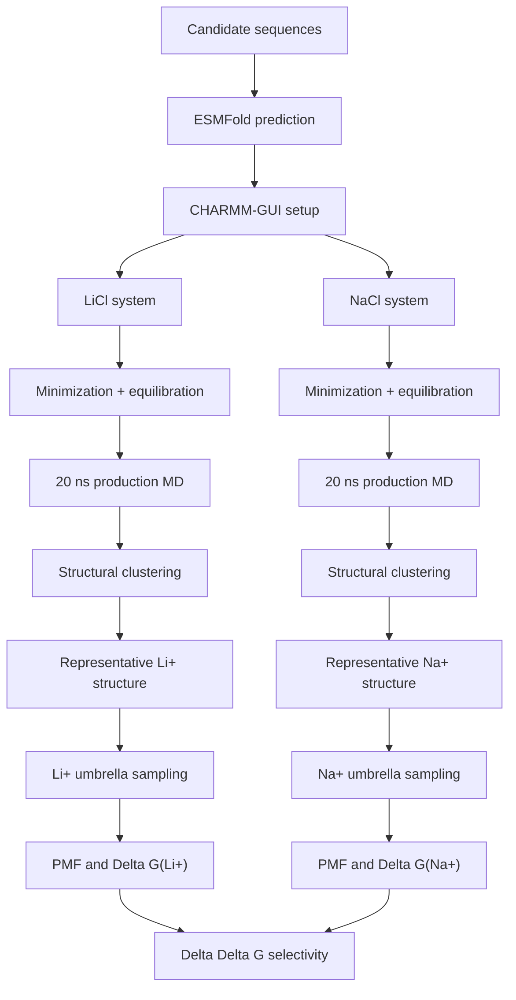
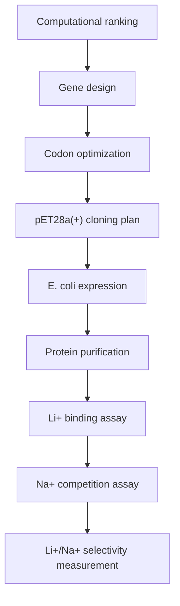
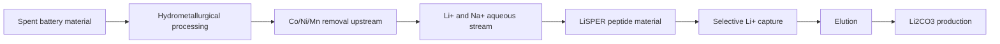

# LiSPER

**Lithium Selective Protein Engineering and Recovery**

**Project title:** Engineering lithium recognition through de novo design of intrinsically disordered peptides inspired by lithium-binding motifs.

LiSPER is a computational and experimental protein-engineering project focused on one central question:

> Can short, IDP-like peptides be designed to prefer Li+ over Na+ in aqueous solution?

The long-term motivation is sustainable lithium recovery from battery-recycling streams, where Li+/Na+ separation is a key challenge after upstream removal of transition metals.

---

## Project Snapshot

| Area | Current State |
|---|---|
| Candidate library | 10 first-round peptides designed and documented |
| Structure prediction | ESMFold outputs organized and validated |
| CHARMM-GUI setup | 10 LiCl systems and 10 NaCl systems ready |
| Equilibration MD | LiCl complete; NaCl complete |
| Production MD | 20 ns LiCl production/clustering is running on remote |
| Next scientific gate | Structural clustering and representative structures |
| Final comparison | Delta Delta G = Delta G(Li+) - Delta G(Na+) |

More negative Delta Delta G values indicate stronger lithium preference.

---

## Scientific Logic

LiSPER combines three design ideas:

| Design Element | Role in the Hypothesis |
|---|---|
| GPGNP / GPGDP motifs | Literature precedent for lithium-binding peptide behavior |
| Gly / Ser / Pro-rich composition | Flexibility and IDP-like conformational sampling |
| Asp/Glu oxygen donors | Potential ion-coordination sites, while limiting total charge |

The goal is **not** merely strong Li+ binding. The goal is **selective Li+ binding over Na+**.

---

## First-Round Candidate Library

| Rank | Candidate | Sequence | Design Intent | Starting Priority |
|---:|---|---|---|---|
| 1 | LiD3-1 | GPGDPGSGPGDPGSGPGDP | Repeated GPGDP motif with Gly/Ser flexibility | Primary |
| 2 | LiND-1 | GPGNPGSGPGDPGSGPGNP | Combines GPGNP and GPGDP motifs | Primary |
| 3 | IDP-Li-1 | SGDSGPGDPGDSG | Flexible acidic shell around GPGDP | Primary |
| 4 | IDP-Li-2 | GDSGSGPGDPGSGDS | Symmetric disordered binding pocket | Screen |
| 5 | LowCharge-Li | GPGDPGSGNPGSGDP | Reduced charge to control nonspecific binding | Primary |
| 6 | LiD2-IDP | GPGDPGSDGSGPGDP | Two GPGDP motifs with acidic spacer | Screen |
| 7 | StrongBind-Li | GPGDPGSDGPGDPGSD | Higher Asp density for stronger capture | Screen |
| 8 | SoftCage-Li | GSGDPGNGDPGSG | Short oxygen-rich flexible cage | Screen |
| 9 | IDP-Rich-Li | DSGDSGPGDPGDSGS | Strongly disordered acidic design | Screen |
| 10 | Control-Negative | GPGAPGSGPGAPGSGPGAP | Neutral motif-related control | Control |

Recommended starting subset:

`LiD3-1`, `LiND-1`, `IDP-Li-1`, `LowCharge-Li`, `Control-Negative`

---

## Computational Workflow

Why clustering matters: these are flexible, IDP-like peptides. A random trajectory frame may represent a rare state. Clustering identifies the most populated conformations, making umbrella sampling more statistically meaningful.

---

## Simulation Choices

| Decision | Value | Reason |
|---|---|---|
| Force field | CHARMM36m | Protein/IDP-compatible CHARMM workflow |
| Water model | TIP3P | CHARMM-GUI default for this setup |
| Ion systems | Separate LiCl and NaCl | Clean Li+ vs Na+ free-energy comparison |
| First production length | 20 ns | Enough to begin conformational clustering |
| Mixed-ion systems | Not first round | Reserved for later competition validation |

---

## Experimental Translation

The computational and experimental branches meet at candidate prioritization: peptides with favorable Li+/Na+ selectivity and interpretable conformational behavior become wet-lab targets.

---

## Battery-Recycling Context

LiSPER currently focuses on Li+ vs Na+ separation. Co2+, Ni2+, and Mn2+ are treated as upstream-removal species rather than first-round selectivity targets.

---

## Repository Map

| Folder | Purpose |
|---|---|
| `sequences/` | Candidate sequences and metadata |
| `esmfold/` | Structure predictions and CHARMM-GUI-safe PDBs |
| `charmm-gui/` | LiCl and NaCl system-builder outputs |
| `md/` | GROMACS scripts, remote logs, equilibration, production, clustering |
| `umbrella/` | Future umbrella windows and pulling setups |
| `pmf/` | Future PMF and Delta G analysis |
| `literature/` | IDP and lithium-binding peptide papers |
| `plasmids/` | Vector maps and cloning design records |
| `wetlab/` | Expression, purification, and assay planning |
| `docs/` | Design rationale, workflow notes, repository guide |
| `inbox/` | Temporary drop zone for unsorted files |

---

## Key Documents

- [Repository guide](docs/repository_guide.md)
- [Candidate design rationale](docs/candidate_design_rationale.md)
- [MD to PMF workflow](docs/md_to_pmf_workflow.md)
- [LiCl MD status](md/li_cl/remote_runs/remote_status.md)
- [NaCl MD status](md/na_cl/remote_runs/remote_status.md)

---

## Current Working Principle

For LiSPER, the correct path is:

`ESMFold -> CHARMM-GUI -> equilibration -> production MD -> clustering -> representative structures -> umbrella sampling -> PMF -> selectivity`

The project should avoid the shortcut:

`ESMFold -> umbrella sampling`

because flexible peptides require ensemble-aware structure selection.
