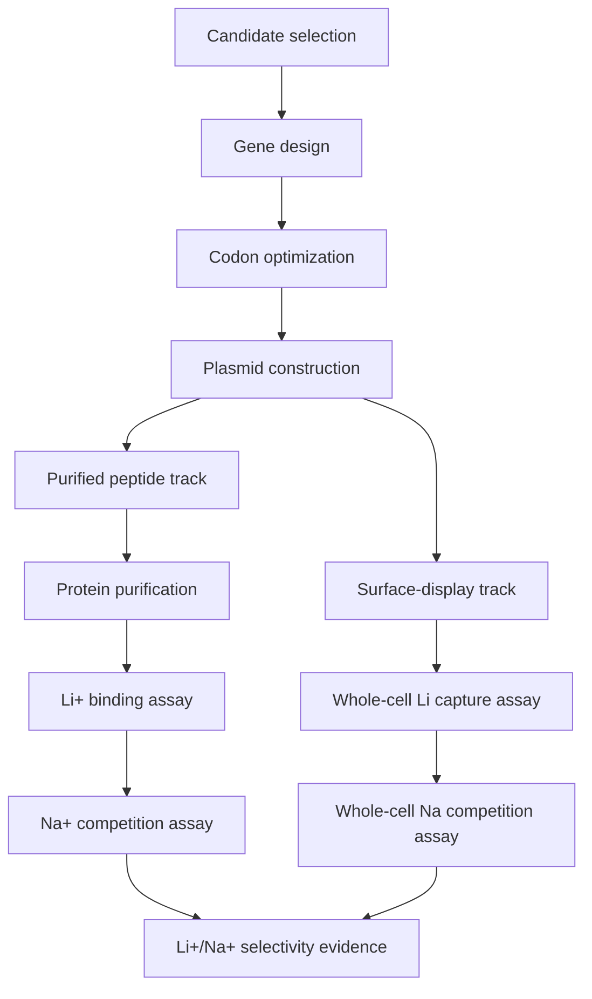

# Wet Lab

Experimental planning and results for expression, purification, surface display, and Li+/Na+ selectivity assays.

## Experimental Workflow

## Assay Design Packages

| Folder | Purpose |
|---|---|
| `surface_display_assays/` | Whole-cell Li+/Na+ binding and selectivity assay design for future eCPX surface-display constructs. |
| `../validation_framework/` | Overall Track A/Track B validation logic and complete protocol documents. |

## Records to Keep

| Record | Folder Use |
|---|---|
| Expression conditions | Compare constructs and induction conditions |
| Purification notes | Track yield and purity |
| Binding assay data | Validate computational predictions |
| Na+ competition data | Measure selectivity directly |
