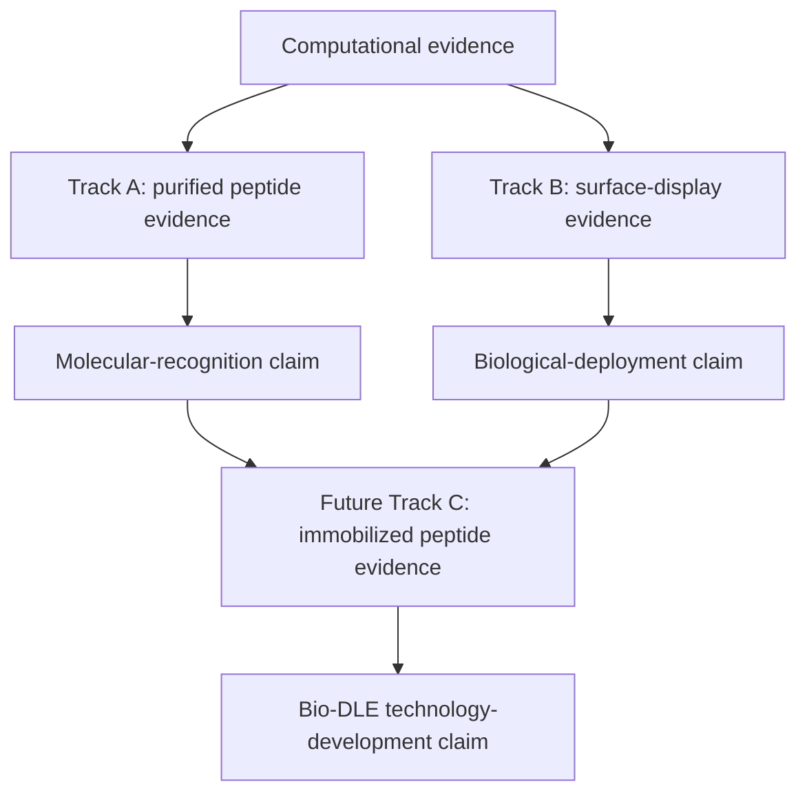
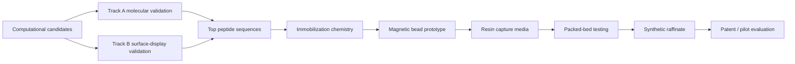

# LiSPER Unified Validation Framework

## Core Message

LiSPER is not a single validation pathway. It is a staged evidence framework that connects computational design, molecular recognition, biological deployment, and future industrial translation.



## Evidence Layers

| Evidence layer | Experiment | What it proves | What it does not prove |
|---|---|---|---|
| Computational evidence | ESMFold, MD, clustering, umbrella sampling, PMF | Designed candidates have plausible Li/Na selectivity mechanisms and rankable hypotheses. | Real binding occurs experimentally. |
| Purified peptide evidence | His6-SUMO expression, cleavage, peptide recovery, Li/Na assays | LiSPER peptide sequence itself can recognize Li+ preferentially over Na+. | Surface display or industrial deployment works. |
| Surface-display evidence | eCPX display, surface verification, whole-cell Li/Na capture | LiSPER can function on a biological surface and capture Li+ in a cellular format. | Binding is solely peptide-intrinsic without scaffold/cell contribution. |
| Future immobilized peptide evidence | peptide on beads/resin, packed-bed testing | LiSPER can become a reusable capture material. | Living-cell display performance or intrinsic solution behavior unless separately shown. |

## Coherent Scientific Story

The strongest LiSPER story is:

1. Computational design proposes short, IDP-like lithium-selective peptide candidates.
2. MD/PMF analysis prioritizes candidates by predicted Li+/Na+ preference.
3. Track A tests whether isolated LiSPER peptides show molecular Li+/Na+ selectivity.
4. Track B tests whether LiSPER remains functional when displayed on cells.
5. Future immobilization tests whether validated LiSPER ligands can become reusable capture media.
6. Together, the evidence supports Bio-DLE technology development.

## What Each Experiment Proves

### Computational Discovery

Proves:

- candidates are rationally designed,
- ion-binding hypotheses are explicit,
- Li/Na selectivity can be ranked computationally,
- representative conformations are selected from MD ensembles.

Does not prove:

- real-world binding,
- experimental selectivity,
- deployability.

### Track A: Purified Peptide Validation

Proves:

- the peptide sequence itself can bind Li+,
- Li binding can exceed Na binding,
- computational predictions have molecular experimental support.

Does not prove:

- eCPX surface display works,
- whole-cell capture works,
- immobilized resin works,
- industrial raffinate tolerance.

### Track B: Surface Display Validation

Proves:

- LiSPER can be expressed/displayed on a cell surface,
- the displayed peptide is accessible,
- whole cells can capture Li+,
- Li capture can exceed Na capture under controlled conditions.

Does not prove:

- purified peptide alone binds Li selectively,
- cell/scaffold/tag effects are irrelevant unless controlled,
- immobilized industrial media will work.

### Future Immobilized Peptide Validation

Proves:

- LiSPER can be converted into a reusable capture material,
- regeneration and process cycling may be possible,
- packed-bed or bead-based operation is plausible.

Does not prove:

- mechanism is identical to purified peptide or cell-surface display,
- performance in real industrial raffinate without further tests.

## Publication Strategy

Minimum strong manuscript package:

- computational candidate-design rationale,
- MD/PMF ranking for Li vs Na,
- Track A data for at least top candidates plus Control-Negative,
- Track B surface-display evidence for at least top candidates plus empty scaffold and Control-Negative,
- clear discussion of what each route proves.

Possible manuscript claims:

- "De novo designed IDP-like peptides show evidence of Li+/Na+ selectivity."
- "Surface display preserves LiSPER function in a whole-cell capture format."
- "Computational ranking can guide biological validation of lithium-selective peptides."

Claims to avoid until future data:

- "Industrial lithium recovery is demonstrated."
- "LiSPER is ready for real battery raffinate."
- "Surface-display binding proves peptide-intrinsic selectivity without purified peptide evidence."
- "Purified peptide binding proves whole-cell or immobilized deployment."

## Technology Development Strategy



## Decision Gates

| Gate | Advance if | Redirect if |
|---|---|---|
| Computational to Track A | candidate has plausible structure/PMF behavior and synthesis/expression feasibility | redesign sequence or deprioritize. |
| Track A to stronger molecular claim | peptide identity confirmed and Li/Na selectivity above controls | troubleshoot production/recovery or assay format. |
| Computational to Track B | candidate is prioritized and construct can include rigorous controls | delay plasmid design until assay controls are defined. |
| Track B to deployment research | displayed cells show Li selectivity above scaffold/cell controls | revise tag/linker/scaffold or return to purified peptide evidence. |
| Validation to immobilization | at least one candidate has Track A or Track B evidence | continue validation before industrial claims. |

## How To Frame Technical Difficulties

Track A technical difficulties:

- low yield,
- instability,
- cleavage failure,
- recovery loss.

Interpretation:

- These are production challenges, not direct evidence that LiSPER lacks selectivity.

Track B technical difficulties:

- poor display,
- scaffold background,
- tag interference,
- high cell-surface adsorption.

Interpretation:

- These are deployment-format challenges, not direct evidence that purified LiSPER cannot bind Li.

## Final Framework Statement

LiSPER should be presented as a multi-evidence platform:

```text
Computational evidence identifies candidates.
Purified peptide evidence tests molecular recognition.
Surface-display evidence tests biological deployment.
Immobilized peptide evidence will test process translation.
```

The combined evidence is stronger than any single route because it separates mechanism from deployment while still connecting both to the long-term Bio-DLE vision.

