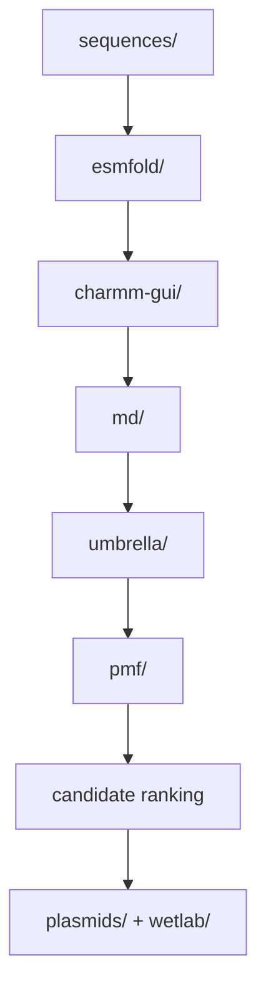

# LiSPER Repository Guide

LiSPER asks whether de novo designed, IDP-like peptides can selectively bind Li+ over Na+ in aqueous solution.

## Main Data Flow

## Folder Roles

| Folder | Role |
|---|---|
| `sequences/` | Candidate library and sequence metadata |
| `esmfold/` | Predicted starting structures and CHARMM-GUI-safe PDBs |
| `charmm-gui/` | Separate LiCl and NaCl system setup outputs |
| `md/` | Minimization, equilibration, production, clustering, remote logs |
| `umbrella/` | Future umbrella sampling inputs and trajectories |
| `pmf/` | Future PMF analysis and selectivity tables |
| `literature/` | IDP and lithium-binding peptide papers |
| `plasmids/` | Vector maps, cloning plans, construct records |
| `wetlab/` | Expression, purification, and binding assay records |
| `docs/` | Design rationale, workflow notes, repository documentation |
| `inbox/` | Temporary drop zone for unsorted files |

## Naming Convention

Use candidate IDs exactly as listed in `sequences/candidates.tsv`.

| Rank | Candidate |
|---:|---|
| 1 | `LiD3-1` |
| 2 | `LiND-1` |
| 3 | `IDP-Li-1` |
| 4 | `IDP-Li-2` |
| 5 | `LowCharge-Li` |
| 6 | `LiD2-IDP` |
| 7 | `StrongBind-Li` |
| 8 | `SoftCage-Li` |
| 9 | `IDP-Rich-Li` |
| 10 | `Control-Negative` |

Ion-specific folders should include the condition, for example `LiD3-1_LiCl` or `LiD3-1_NaCl`.

## Inbox Workflow

The inbox should stay mostly empty after processing. Permanent project files should live in the relevant folder.

## Design Logic

The first-round library links three ideas:

- GPGDP/GPGNP motifs provide lithium-binding precedent.
- Gly/Ser/Pro-rich sequence design provides IDP-like flexibility.
- Asp/Glu oxygen donors may coordinate ions, while limited charge reduces nonspecific binding risk.

Every candidate is evaluated against both Li+ and Na+, including the negative control.
