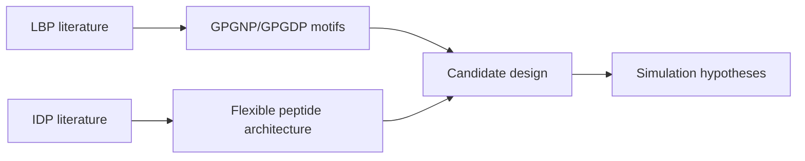

# Literature

Papers and source material supporting LiSPER design logic.

## Collections

| Folder | Focus |
|---|---|
| `Literature Review/IDP/` | Intrinsically disordered proteins and flexible metal-binding regions |
| `Literature Review/LBP/` | Lithium-binding peptides, surface display, and lithium recovery |

## How Literature Feeds the Project

Use this folder for PDFs, citation exports, reading notes, and evidence tables.
