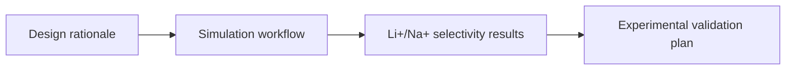

# Manuscript

Drafts, outlines, tables, figure captions, and supplementary-material planning.

## Story Arc

Use this folder for publication-style organization. Keep raw analysis and trajectories in `../analysis/`, `../md/`, `../umbrella/`, and `../pmf/`.
