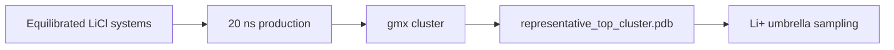

# LiCl Molecular Dynamics

Remote GROMACS workflow and synced results for peptide + LiCl systems.

## Status

| Stage | Status |
|---|---|
| CHARMM-GUI QC | 10/10 ready |
| Minimization | 10/10 complete |
| Equilibration | 10/10 complete |
| 20 ns production | Running: `LiD3-1` at 6.67 ns / 20 ns |
| Structural clustering | Waiting for first production run to finish |

Latest QC snapshot: [remote_runs/current_production_snapshot.md](remote_runs/current_production_snapshot.md).

## Key Files

| File / Folder | Purpose |
|---|---|
| `ready_gromacs_systems.tsv` | Systems passed from CHARMM-GUI QC |
| `remote_runs/` | Remote scripts, logs, and status snapshots |
| `remote_results/` | Synced GROMACS outputs |
| `remote_runs/current_production_snapshot.md` | Active production progress |
| `remote_runs/remote_status.md` | Current remote status |

## Handoff Logic

