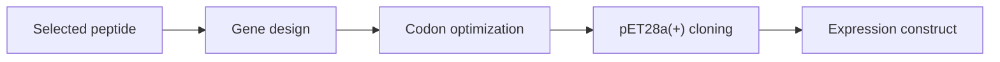

# Plasmids

Vector maps, construct planning, codon optimization records, and cloning notes.

## Current Vector Map

| File | Purpose |
|---|---|
| `vector_maps/pET28a_plus.dna` | Uploaded pET28a(+) map for future expression design |

## Construct Flow

This folder should eventually connect computational candidate IDs to wet-lab construct IDs.
